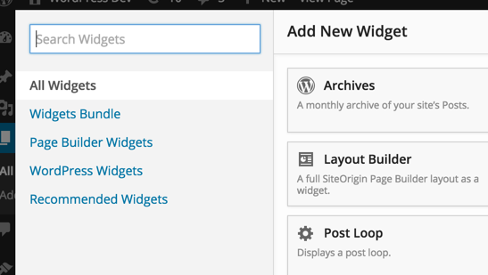

#Page Builder Widget Groups

Widget groups give you a way to keep your widgets organized within the **Add Widget** dialog.



You can add your own groups using the `siteorigin_panels_widget_dialog_tabs` filter. You need to add tabs and assign these tabs a group filter.

```php
function mytheme_add_widget_tabs($tabs) {
	$tabs[] = array(
		'title' => __('My Tab', 'mytheme'),
		'filter' => array(
			'groups' => array('mytheme')
		)
	);
	
	return $tabs;
}
add_filter('siteorigin_panels_widget_dialog_tabs', 'mytheme_add_widget_tabs', 20);
```

Next you just need to make sure that you assign your widgets a group. You can either do this by filtering the widgets array using `siteorigin_panels_widgets` and add a `groups` attribute to each of your widgets, or you can add a `panels_group` argument to the `$widget_options` argument of the `WP_Widget` constructor.

### Filtering Page Builder Widgets

```php
function mytheme_add_widget_icons($widgets){
	$widgets['My_Widget']['groups'] = array('mytheme');
	return $widgets;
}
add_filter('siteorigin_panels_widgets', 'mytheme_add_widget_icons');
```

### Widgets Argument

```php
class Foo_Widget extends WP_Widget {

	/**
	 * Register widget with WordPress.
	 */
	function __construct() {
		parent::__construct(
			'foo_widget', // Base ID
			__( 'Widget Title', 'text_domain' ), // Name
			array(
				'description' => __( 'A Foo Widget', 'text_domain' ),
				'panels_groups' => array('mytheme')
			)
		);
	}
}
```
