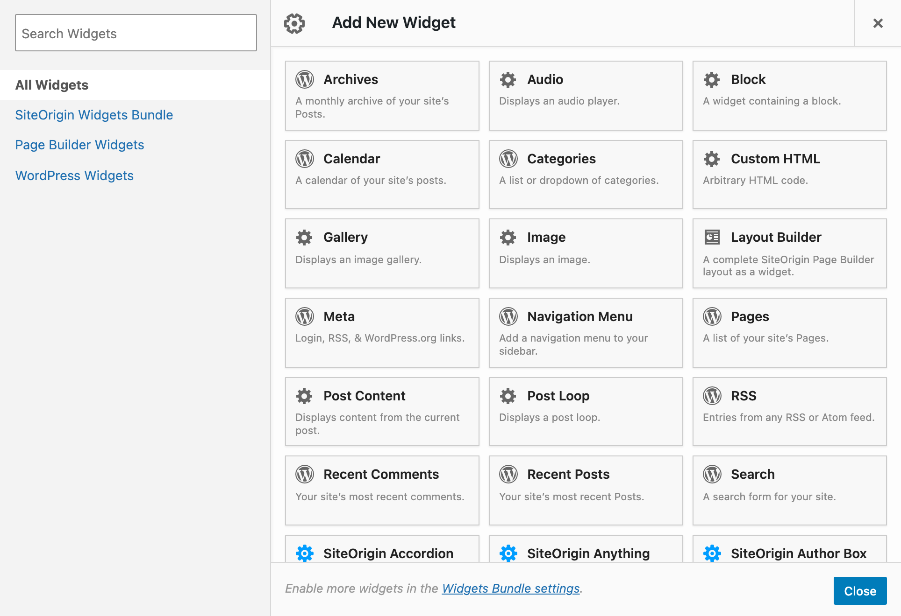

# Page Builder Widget Groups

Widget groups sort widgets into tabs in the **Add Widget** dialog, so users find related widgets together.



## Adding a Tab

The `siteorigin_panels_widget_dialog_tabs` filter adds tabs to the dialog. Each tab has a title and a filter that lists the groups it shows:

```php
function mytheme_add_widget_tabs($tabs) {
	$tabs[] = array(
		'title' => __('My Tab', 'mytheme'),
		'filter' => array(
			'groups' => array('mytheme')
		)
	);
	
	return $tabs;
}
add_filter('siteorigin_panels_widget_dialog_tabs', 'mytheme_add_widget_tabs', 20);
```

## Adding Widgets to a Group

Give each of your widgets a group that a tab shows. Add a `panels_groups` argument to the `$widget_options` argument of the `WP_Widget` constructor:

```php
class Foo_Widget extends WP_Widget {

	/**
	 * Register widget with WordPress.
	 */
	function __construct() {
		parent::__construct(
			'foo_widget', // Base ID
			__( 'Widget Title', 'text_domain' ), // Name
			array(
				'description' => __( 'A Foo Widget', 'text_domain' ),
				'panels_groups' => array('mytheme')
			)
		);
	}
}
```

The `siteorigin_panels_widgets` filter sets the groups of any widget, including widgets you didn't write. The keys of the widgets array are the widgets' PHP class names:

```php
function mytheme_add_widget_groups($widgets){
	if ( isset( $widgets['My_Widget'] ) ) {
		$widgets['My_Widget']['groups'] = array('mytheme');
	}
	return $widgets;
}
add_filter('siteorigin_panels_widgets', 'mytheme_add_widget_groups');
```

Page Builder sets the groups of WordPress core widgets at priority 10, and the Widgets Bundle sets the groups of its own widgets at priority 11. To change the groups of those widgets, add your filter at priority 12 or higher:

`add_filter( 'siteorigin_panels_widgets', 'your_function', 12 );`

## Recommending Widgets

Widgets in the `recommended` group appear in the **Recommended Widgets** tab:

```php
function add_my_widget_into_recommended_group( $widgets ) {
    
    if ( isset( $widgets['My_Widget'] ) ) {
        $widgets['My_Widget']['groups'][] = 'recommended';
    }
    return $widgets;
}

add_filter( 'siteorigin_panels_widgets', 'add_my_widget_into_recommended_group', 12 );
```

A loop through their class names recommends several widgets at once:

```php
function set_so_widget_into_recommended_group( $widgets ) {
    
    $recommended_classes = array(
        'My_Widget_1',
        'My_Widget_2'
    );
    
    foreach ( $recommended_classes as $widget_class ) {
        if ( isset( $widgets[ $widget_class ] ) ) {
            $widgets[ $widget_class ]['groups'][] = 'recommended';
        }
    }
    return $widgets;
}
add_filter( 'siteorigin_panels_widgets', 'set_so_widget_into_recommended_group', 12 );
```

## Caching

Page Builder caches the widget list in the `siteorigin_panels_widgets` transient for 10 minutes. It caches its own dialog tabs, including the **Recommended Widgets** tab, in the `siteorigin_panels_widget_dialog_tabs` transient for a day. The **Recommended Widgets** tab appears only if a widget was in the `recommended` group when Page Builder built that transient. Delete both transients while you develop to see your changes right away.
