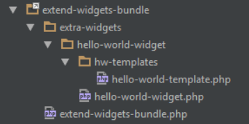

# Creating a widget

What follows are the basic requirements for creating your own widget using the SiteOrigin Widgets Bundle as a framework.

## Widget name

Start by creating your wiget folder using a name of your choice, and then a PHP file with the same name. We encourage the use of the WordPress guidelines for naming files and folders, which you can find <a href="http://codex.wordpress.org/Writing_a_Plugin#Names.2C_Files.2C_and_Locations" target="_blank">here</a>.

## Widget metadata

The first thing you'll need in your PHP file is the metadata header which is used by the SiteOrigin Widgets Bundle plugin to identify PHP files which contain a widget class. The minimum requirement for this header is the Widget Name field, as without this field the file will be skipped. The rest of the fields are optional but we encourage their use, as they provide the option to display more detailed information about the widget and/or widget author in future.

```php
<?php

/*
Widget Name: Hello world widget
Description: An example widget which displays 'Hello world!'.
Author: Me
Author URI: http://example.com
Widget URI: http://example.com/hello-world-widget-docs,
Video URI: http://example.com/hello-world-widget-video
*/

```

## Widget class

Now you'll need to create a class which extends the `SiteOrigin_Widget` abstract base class and, as a minimum, overrides the `get_template_name` and `get_style_name` abstract methods. You'll also need to register your widget class with the SiteOrigin Widgets Bundle using the `siteorigin_widget_register` function, passing in the widget id, widget file path, and widget class name as arguments.

```php

class Hello_World_Widget extends SiteOrigin_Widget {

	function get_template_name($instance) {
		return '';
	}

	function get_style_name($instance) {
		return '';
	}
}

siteorigin_widget_register('hello-world-widget', __FILE__, 'Hello_World_Widget');
```

Once you've done this, you'll see your widget in the Plugins > SiteOrigin Widgets list, it can be activated and deactivated, and you'll see an 'Untitled Widget' in Page Builder widgets and a blank widget in other widget lists. So you can't really use your widget yet, but it's there!

## Widget class constructor

Here you'll see how to implement the constructor for your widget. The `SiteOrigin_Widget` class extends the `WP_Widget` class so the parent constructor call might look familiar, with a few additions.

```php
function __construct() {
	//Here you can do any preparation required before calling the parent constructor, such as including additional files or initializing variables.

	//Call the parent constructor with the required arguments.
	parent::__construct(
		// The unique id for your widget.
		'hello-world-widget',

		// The name of the widget for display purposes.
		__('Hello World Widget', 'hello-world-widget-text-domain'),

		// The $widget_options array, which is passed through to WP_Widget.
		// It has a couple of extras like the optional help URL, which should link to your sites help or support page.
		array(
			'description' => __('A hello world widget.', 'hello-world-widget-text-domain'),
			'help'        => 'http://example.com/hello-world-widget-docs',
		),

		//The $control_options array, which is passed through to WP_Widget
		array(
		),

		//The $form_options array, which describes the form fields used to configure SiteOrigin widgets. We'll explain these in more detail later.
		array(
			'text' => array(
				'type' => 'text',
				'label' => __('Hello world! goes here.', 'siteorigin-widgets'),
				'default' => 'Hello world!'
			),
		),

		//The $base_folder path string.
		plugin_dir_path(__FILE__)
	);
}
```

Once you have your constructor implemented like the above example, you should see your widget's name and description being displayed in the various widget configuration lists. The Hello World widget will now also display a text field in the Edit Widget form containing the text 'Hello world!', which can be edited and saved.

## Widget template

You need to provide a template to tell the widget how it should be displayed. You supply a template name by overriding the `get_template_name` function and returning the name of the template file, without a `.php` file extension. By default, the base `SiteOrigin_Widget` class looks for a PHP file, with the name returned by `get_template_name`, in a `tpl` directory, in the widget directory. You can change this behaviour by overriding the `get_template_dir` function and returning the path of a directory (without leading or trailing slashes), relative to the widget class file.

```php
function get_template_name($instance) {
	return 'hello-world-template';
}

function get_template_dir($instance) {
	return 'hw-templates';
}
```

Below is the directory structure of the Hello World Widget.



Now that the widget knows where to find it's template you can add in some HTML. The Hello World widget template simply contains the following:

```php
<div>
	<?php echo wp_kses_post($instance['text']) ?>
</div>
```

And now you can see your widget being displayed!