# Form fields

This is where you'll find a lot of the convenience of using the SiteOrigin Widgets Bundle as a framework for creating your own widgets. The widget form fields are a way for you to define the configuration fields you'd like to allow for your widget users. The more form fields you provide, the more customizable your widget becomes.

## Form field descriptors

The form fields options are passed into the `SiteOrigin_Widget` class constructor as an array and stored in the `$form_options` instance variable. Each value in the array is a form field descriptor, which is an associative array describing the form field to be rendered by the `SiteOrigin_Widget` base class, in order to capture configuration values for a widget instance. Each form field descriptor must at least have a type, however a few of the types won't be useful without additional configuration values. Optional base form field descriptor values are listed below:

- label: `string` Render a label for the field with the given value.
- default: `mixed` The field will be prepopulated with this default value.
- description: `string` Render small italic text below the field to describe the field's purpose.
- optional: `bool` Append '(Optional)' to this field's label as a small green superscript.
- sanitize: `string` Specifies sanitization type to be performed on input from this field. Available sanitizations are'email' and 'url'. If the specified sanitization isn't recognized it is assumed to be a custom sanitization and a filter is applied using the pattern `'siteorigin_widgets_sanitize_field_' . $sanitize`, in case the sanitization is defined elsewhere.

In addition to these, some fields have their own specific configuration values, which are listed in the respective sections below.

>You can see all of these in action by installing and activating the SiteOrigin Widget Form Fields Demo plugin which can be found in the [so-dev-examples](https://github.com/siteorigin/so-dev-examples) repository.

## Form field types

### text
Renders a text input field.

#### Additional options
- placeholder: `string` A string to display before any text has been input.
- readonly: `bool` If true, this field will not be editable.

#### Example
Form options input:
```php
$form_options = array(
	'some_text' => array(
		'type' => 'text',
		'label' => __('Some text goes here', 'widget-form-fields-text-domain'),
		'default' => 'Some default text.'
	)
);
```
Result:

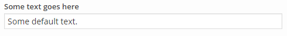

---

### link
Renders an input field for entering any URL and a button for convenient selection of content from public posts (except attachments).

#### Additional options
- placeholder: `string` A string to display before any text has been input.
- readonly: `bool` If true, this field will not be editable.
- post_types: `array` Array of strings post types by which to search.

#### Example
Form options input:
```php
$form_options = array(
	'some_url' => array(
		'type' => 'link',
		'label' => __('Some URL goes here', 'widget-form-fields-text-domain'),
		'default' => 'http://www.example.com'
	)
);
```
Result:

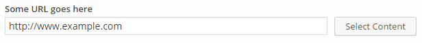

---

### color
Renders a color input field and color picker.

#### Additional options
- placeholder: `string` A string to display before any text has been input.

#### Example
Form options input:
```php
$form_options = array(
	'some_color' => array(
		'type' => 'color',
		'label' => __( 'Choose a color', 'widget-form-fields-text-domain' ),
		'default' => '#bada55'
	)
);
```
Result:


---

### number
Renders a text input field for entering a number. This is the same as the _text_ field, except that the input is cast as a `float`.

#### Additional options
- placeholder: `string` A string to display before any text has been input.
- readonly: `bool` If true, this field will not be editable.

#### Example
Form options input:
```php
$form_options = array(
	'some_number' => array(
		'type' => 'number',
		'label' => __( 'Enter a number', 'widget-form-fields-text-domain' ),
		'default' => '12654'
	)
);
```
Result:

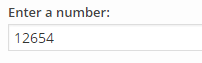

---

### measurement
Renders a field for entering a [unit of measurement](https://developer.mozilla.org/en-US/docs/Learn/CSS/Introduction_to_CSS/Values_and_units#Numeric_values). This is the same as the text field, except that the input includes unit of measurements.

#### Additional options
- placeholder: `string` A string to display before any text has been input.
- readonly: `bool` If true, this field will not be editable.

#### Example
Form options input:


```php
$form_options = array(
	'example_size' => array(
		'type' => 'measurement',
		'label' => __('Size', 'widget-form-fields-text-domain'),
		'default' => '10px',
	)
);
```

Result:

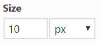

### multi measurement
Renders multiple fields for entering [unit of measurement](https://developer.mozilla.org/en-US/docs/Learn/CSS/Introduction_to_CSS/Values_and_units#Numeric_values). This field type is typically used for things like margins, borders, and paddings.

#### Additional options
- measurements: `array` The list of measurement options
-- units: `array` The selector units of measurement. If no units are set, default units are used -  `px`, `%`, `in`, `cm`, `mm`, `em`, `rem`, `pt`, `pc`, `ex`, `ch`, `vw`, `vh`, `vmin`, `vmax`.
- separator: `string` separator for the measurements. Default is an empty space.
- autofill: `bool` Whether to automatically fill the rest of the inputs when the first value is entered. Default is false.

#### Example
Form options input:


```php
$useable_units = array( 'px', '%' );
$form_options = array(
	'padding' => array(
		'type' => 'multi-measurement',
		'autofill' => true,
		'default' => '5% 0px 25px 0px',
		'measurements' => array(
			'padding_top' => array(
				'label' => __( 'Padding Top', 'widget-form-fields-text-domain' ),
				'units' => $useable_units,
			),
			'right' => array(
				'label' => __( 'Padding Right', 'widget-form-fields-text-domain' ),
				'units' => $useable_units,
			),
			'bottom' => array(
				'label' => __( 'Padding Bottom', 'widget-form-fields-text-domain' ),
				'units' => $useable_units,
			),
			'left' => array(
				'label' => __( 'Padding Left', 'widget-form-fields-text-domain' ),
				'units' => $useable_units,
			),
		),
	),
);
```

Result:

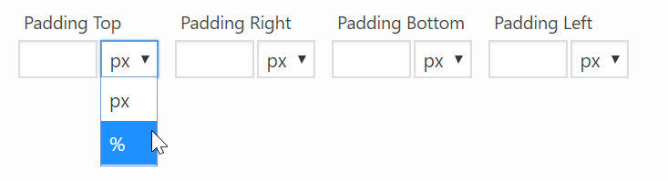

### textarea
Renders a textarea field.

#### Additional options
- rows: `int` The number of visible rows in the textarea.
- placeholder: `string` A string to display before any text has been input.
- readonly: `bool` If true, this field will not be editable.

#### Example
Form options input:
```php
$form_options = array(
	'some_long_message' => array(
		'type' => 'textarea',
		'label' => __( 'Type a message', 'widget-form-fields-text-domain' ),
		'default' => 'An example of a long message.</br>It is even possible to add a few html tags.</br><a href="siteorigin.com" target="_blank"">Links!</a></br><strong>Strong</strong> and <em>emphasized</em> text.',
		'rows' => 10
	)
);
```
Result:

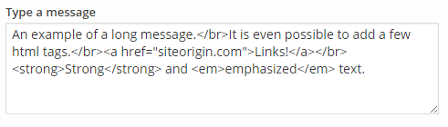

---

### tinymce
Renders a TinyMCE editor field.

#### Additional options
- rows: `int` The number of visible rows in the textarea.
- default_editor: `string` Whether to display the TinyMCE visual editor or the Quicktags HTML editor initially. Allowed values are `'tinymce'` ( can be abbreviated to `'tmce'`), and `'html'`. The default is `'tinymce'`.
- editor_height: `int` The initial height of the editor. Setting this will cause the rows option to be ignored.
- button_filters: `array` An array of filter callbacks to filter the buttons available on the TinyMCE visual editor and the Quicktags HTML editor. The TinyMCE editor can display up to four rows of buttons and the Quicktags editor displays a single row of buttons. Each row can be filtered by specifying a corresponding callback, as follows:
  * First row: `'mce_buttons'`
  * Second row: `'mce_buttons_2'`
  * Third row: `'mce_buttons_3'`
  * Fourth row: `'mce_buttons_4'`
  * Quicktags settings: `'quicktags_settings'`

#### Example
Form options input:
```php
$form_options = array(
	'some_tinymce_editor' => array(
        'type' => 'tinymce',
        'label' => __( 'Visually edit, richly.', 'widget-form-fields-text-domain' ),
        'default' => 'An example of a long message.</br>It is even possible to add a few html tags.</br><a href="siteorigin.com" target="_blank"">Links!</a>',
        'rows' => 10,
        'default_editor' => 'html',
        'button_filters' => array(
            'mce_buttons' => array( $this, 'filter_mce_buttons' ),
            'mce_buttons_2' => array( $this, 'filter_mce_buttons_2' ),
            'mce_buttons_3' => array( $this, 'filter_mce_buttons_3' ),
            'mce_buttons_4' => array( $this, 'filter_mce_buttons_5' ),
            'quicktags_settings' => array( $this, 'filter_quicktags_settings' ),
        ),
	)
);
```
Result:

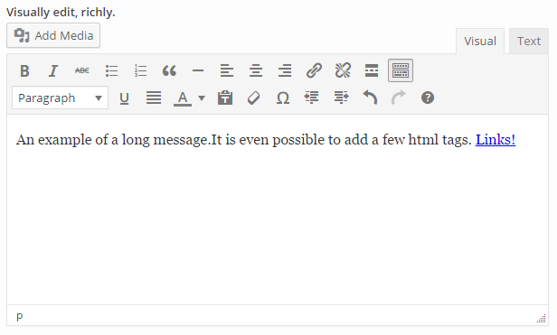

---

### slider
Renders a number slider field to allow the choice of a number in a range.

#### Additional options
- min: `int` The minimum value of the allowed range.
- max: `int` The maximum value of the allowed range.

#### Example
Form options input:
```php
$form_options = array(
	'some_number_in_a_range' => array(
		'type' => 'slider',
		'label' => __( 'Choose a number', 'widget-form-fields-text-domain' ),
		'default' => 24,
		'min' => 2,
		'max' => 37,
		'integer' => true
	)
);
```
Result:

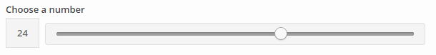

---

### order
Renders a list of options that the user can reorder. For usage, please refer to [this tutorial](./order-field.md)

#### Additional options
- options: `array` The list of options which can be reordered
- max: `int` The maximum value of the allowed range.

#### Example
Form options input:
```php
$form_options = array(
	'ordering' => array(
		'type' => 'order',
		'label' => __( 'Element Order', 'widget-form-fields-text-domain' ),
		'options' => array(
			'section' => __( 'Section', 'widget-form-fields-text-domain' ),
			'divider' => __( 'Content', 'widget-form-fields-text-domain' ),
			'other section' => __( 'Other Section', 'widget-form-fields-text-domain' ),
		),
		'default' => array( 'section', 'divider', 'other section' ),
	),
);
```
Result:

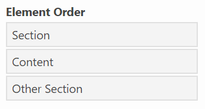

---
### select
Renders a dropdown select field. This field is better for a long list of predefined values. For a short list the radio input field is a better choice.

#### Additional options
- prompt: `string` If present, it is included as a disabled (not selectable) value at the top of the list of options. If there is no default value, it is selected by default. You might even want to leave the label value blank when you use this.
- options `array` The list of options which may be selected.
- multiple `bool` Determines whether this is a single or multiple select field.

#### Example 1 - default value without prompt
Form options input:
```php
$form_options = array(
	'some_selection' => array(
		'type' => 'select',
		'label' => __( 'Choose a thing from a long list of things', 'widget-form-fields-text-domain' ),
		'default' => 'the_other_thing',
		'options' => array(
			'this_thing' => __( 'This thing', 'widget-form-fields-text-domain' ),
			'that_thing' => __( 'That thing', 'widget-form-fields-text-domain' ),
			'the_other_thing' => __( 'The other thing', 'widget-form-fields-text-domain' ),
		)
	)
);
```
Result:

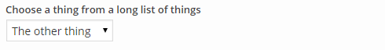

#### Example 2 - prompt without default value
Form options input:
```php
$form_options = array(
	'another_selection' => array(
		'type' => 'select',
		'prompt' => __( 'Choose a thing from a long list of things', 'widget-form-fields-text-domain' ),
		'options' => array(
			'this_thing' => __( 'This thing', 'widget-form-fields-text-domain' ),
			'that_thing' => __( 'That thing', 'widget-form-fields-text-domain' ),
			'the_other_thing' => __( 'The other thing', 'widget-form-fields-text-domain' ),
		)
	)
);
```
Result:


#### Example 3 - multiple select
Form options input:
```php
$form_options = array(
	'another_selection' => array(
		'type' => 'select',
		'label' => __( 'Choose a thing from a long list of things', 'widget-form-fields-text-domain' ),
		'multiple' => true,
		'default' => 'the_other_thing',
		'options' => array(
			'this_thing' => __( 'This thing', 'widget-form-fields-text-domain' ),
			'that_thing' => __( 'That thing', 'widget-form-fields-text-domain' ),
			'the_other_thing' => __( 'The other thing', 'widget-form-fields-text-domain' ),
		)
	)
);
```
Result:

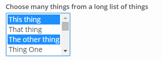

---

### checkbox
Renders a checkbox field.

#### Example
Form options input:
```php
$form_options = array(
	'some_boolean' => array(
		'type' => 'checkbox',
		'label' => __( 'Allow this thing?', 'widget-form-fields-text-domain' ),
		'default' => true
	)
);
```
Result:


---

### checkboxes
Renders a series of checkboxes.

#### Additional options
- options `array` The list of options which may be selected.

#### Example
Form options input:

```php
$form_options = array(
	'potential_options' => array(
		'type' => 'checkboxes',
		'label' => __( 'Allow this thing?', 'widget-form-fields-text-domain' ),
		'options' => array(
			'option' =>  __( 'value', 'widget-form-fields-text-domain' ),
			'other option' =>  __( 'other value', 'widget-form-fields-text-domain' ),
			'another additional option' => __( 'Another possible value', 'widget-form-fields-text-domain' )
		),
	)
);
```

Result:


### radio
Renders a radio input field. This field is better for a short list of predefined values. For a long list the dropdown select field is a better choice.

#### Additional options
- options `array` The list of options which may be selected.

#### Example
Form options input:
```php
$form_options = array(
	'radio_selection' => array(
		'type' => 'radio',
		'label' => __( 'Choose a thing from a short list of things', 'widget-form-fields-text-domain' ),
		'default' => 'that_thing',
		'options' => array(
			'this_thing' => __( 'This thing', 'widget-form-fields-text-domain' ),
			'that_thing' => __( 'That thing', 'widget-form-fields-text-domain' ),
			'the_other_thing' => __( 'The other thing', 'widget-form-fields-text-domain' )
		)
	)
);
```
Result:

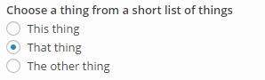

---

### media
Renders a media selector button. When clicked the button opens the WordPress Media Library dialog for the media types specified by the `library` option.

>_This field requires at least WordPress 3.5._

#### Additional options
- choose: `string` A label for the title of the media selector dialog.
- update: `string` A label for the confirmation button of the media selector dialog.
- library: `string` Sets the media library which to browse and from which media can be selected. Allowed values are `'image'`, `'audio'`, `'video'`, and `'file'`. The default is `'image'`.
- fallback: `bool` Whether or not to display a URL input field which allows for specification of a fallback URL to be used in case the selected media resource isn't available.

#### Example
Form options input:
```php
$form_options = array(
	'some_media' => array(
		'type' => 'media',
		'label' => __( 'Choose a media thing', 'widget-form-fields-text-domain' ),
		'choose' => __( 'Choose image', 'widget-form-fields-text-domain' ),
		'update' => __( 'Set image', 'widget-form-fields-text-domain' ),
		'library' => 'image',
		'fallback' => true
	)
);
```
Result:

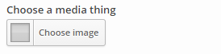

---

### image size
Renders a dropdown with all of [the available image sizes](https://developer.wordpress.org/reference/functions/add_image_size/) on the widget users website. This field is commonly used in conjunction with the Media field to allow the user more control over the image output. Please refer to the [Image Sizes tutorial](./image-sizes-field.md) for usage instructions.

> This field requires at least WordPress 2.9.

#### Example
```php
$form_options = array(
	'size' => array(
		'type' => 'image-size',
		'label' => __( 'Image size', 'widget-form-fields-text-domain' ),
	)
);
```
Result:

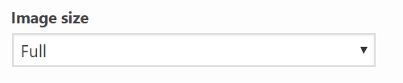

Possible Image Size values:
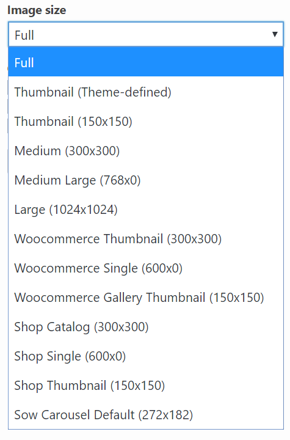

### posts
Renders a post selector field. This can be used to build custom queries with which to select posts from your database. The field displays a small red indicator which shows the number of posts currently being selected. By default, all posts are selected.

You can find more detail about the use of the post selector field [here](./post-selector.md).

#### Example
Form options input:
```php
$form_options = array(
	'some_posts' => array(
		'type' => 'posts',
		'label' => __('Some posts query', 'widget-form-fields-text-domain'),
	)
);
```
Result:

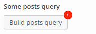

---

### section
The section field type provides a convenient way to group and hide related form fields. This is useful when you have a large form which can appear overwhelming.

#### Additional options
- hide: `bool` Whether or not this section should start out collapsed or expanded.
- fields: `array` The set of fields to be grouped together. This should contain any combination of other field types, even repeaters and sections.

#### Example
Form options input:
```php
$form_options = array(
	'a_section' => array(
		'type' => 'section',
		'label' => __( 'A section containing related fields.' , 'widget-form-fields-text-domain' ),
		'hide' => true,
		'fields' => array(
			'grouped_text' => array(
				'type' => 'text',
				'label' => __( 'A grouped text field', 'widget-form-fields-text-domain' )
			),
			'grouped_checkbox' => array(
				'type' => 'checkbox',
				'label' => __( 'A grouped checkbox', 'widget-form-fields-text-domain' )
			)
		)
	)
);
```
Result:


---

### repeater
The repeater field type provides a convenient way to repeat a specified set of form fields. 

#### Additional options
- item_name: `string` A default label for each repeated item.
- item_label: `array` This associative array describes how the repeater may retrieve the item labels from HTML elements as they are updated. The options are:
  - selector: `string` A JQuery selector which is used to find an element from which to retrieve the item label.
  - update_event: `string` The javascript event on which to bind and update the item label.
  - value_method: `string` The javascript function which should be used to retrieve the item label from an element.
- fields: `array` The set of fields to be repeated together as one item. This should contain any combination of other field types, even repeaters and sections.
- scroll_count: `int` The maximum number of repeated items to display before adding a scrollbar to the repeater.
- readonly: `bool` Whether or not items may be added to or removed from this repeater by user interaction.

#### Example
Form options input:
```php
$form_options = array(
	'a_repeater' => array(
		'type' => 'repeater',
		'label' => __( 'A repeating repeater.' , 'widget-form-fields-text-domain' ),
		'item_name'  => __( 'Repeater item', 'siteorigin-widgets' ),
		'item_label' => array(
			'selector'     => "[id*='repeat_text']",
			'update_event' => 'change',
			'value_method' => 'val'
		),
		'fields' => array(
			'repeat_text' => array(
				'type' => 'text',
				'label' => __( 'A text field in a repeater item.', 'widget-form-fields-text-domain' )
			),
			'repeat_checkbox' => array(
				'type' => 'checkbox',
				'label' => __( 'A checkbox in a repeater item.', 'widget-form-fields-text-domain' )
			)
		)
	)
);
```
Result:

Empty repeater:
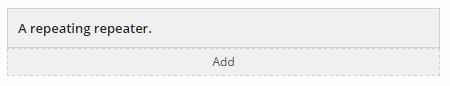

Repeater containing two items (the first item is collapsed and the second item is expanded):
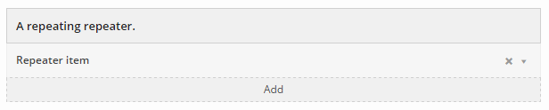

---

### widget
Includes the entire form of an existing widget class.

#### Additional options
- class: `string` The class name of the widget to be included.
- hide: `bool` Whether or not this widget's form section should start out collapsed or expanded.

#### Example
Form options input:
```php
$form_options = array(
	'some_widget' => array(
		'type' => 'widget',
		'label' => __( 'Button Widget', 'widget-form-fields-text-domain' ),
		'class' => 'SiteOrigin_Widget_Button_Widget',
		'hide' => true
	)
);
```
Result:

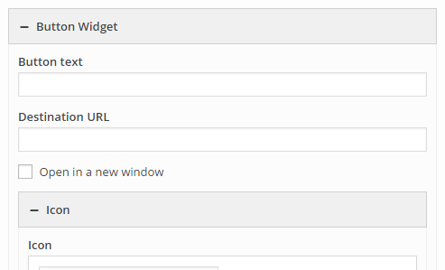

---

### builder
An entire [SiteOrigin Page Builder](https://wordpress.org/plugins/siteorigin-panels/) instance. For usage, please refer to [this tutorial](./builder-field.md)

> This field requires [SiteOrigin Page Builder](https://wordpress.org/plugins/siteorigin-panels/) to be installed and active

#### Additional options
-  builder: `string` The type of page builder instance - currently unused. Defaults to `sow-builder-field`

#### Example
Form options input:

```php
$form_options = array(
	'page_builder' => array(
		'type' => 'builder',
		'label' => __( 'Page Builder', 'widget-form-fields-text-domain'),
	)
);
```

Result:

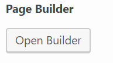

### code 
A textarea field with the [Behave.js library](https://github.com/jakiestfu/Behave.js) set up for it.

#### Additional options
- element_id `string` the id of the code textarea
- element_name `string` the name of the code textarea
- rows: `int` The number of visible rows in the textarea.
- placeholder: `string` A string to display before any text has been input.
- readonly `bool` If true, this field will not be editable.

#### Example
Form options input:

```php
$form_options = array(
	'code_editor' => array(
		'type' => 'code',
		'label' => __( 'Code Editor', 'widget-form-fields-text-domain' ),
	)
);
```

Result:

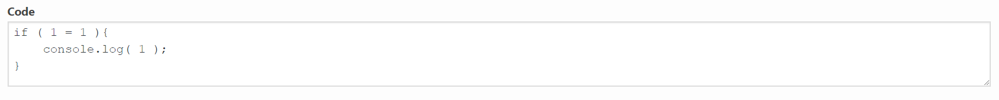

---

### icon
Renders an icon selector field. This allows you to select an icon from a default set of icon families, namely <a href="http://fortawesome.github.io/Font-Awesome/" target="_blank">Font Awesome</a>, <a href="https://icomoon.io/" target="_blank">IcoMoon</a>, <a href="http://genericons.com/" target="_blank">Genericons</a>, <a href="http://typicons.com/" target="_blank">Typicons</a>, and <a href="http://www.elegantthemes.com/blog/freebie-of-the-week/free-line-style-icons" target="_blank">Elegant Themes' Line Icons</a>. You can include your own icon families with the `siteorigin_widgets_icon_families` filter.

You can find more detail about using icons [here](./icons-and-fonts.md).

#### Example
Form options input:
```php
$form_options = array(
	'some_icon' => array(
		'type' => 'icon',
		'label' => __('Select an icon', 'widget-form-fields-text-domain'),
	)
);
```
Result:

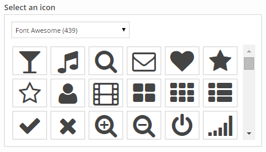

---

### font
Renders a font selector field. This allows you to select a font from a default set of font families, namely the web safe fonts (Helvetica Neue, Lucida Grande, Georgia, and Courier New ) and a selection of font families from the Google Fonts library. By default this field will use the font specified by the active theme.

You can include your own font families with the `siteorigin_widgets_font_families` filter. You can find more detail about extending available fonts [here](./icons-and-fonts.md).

#### Example
Form options input:
```php
$form_options = array(
	'some_font' => array(
		'type' => 'font',
		'label' => __('Select a font', 'widget-form-fields-text-domain'),
	)
);
```
Result:

Default selection:
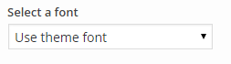

Selecting a font:
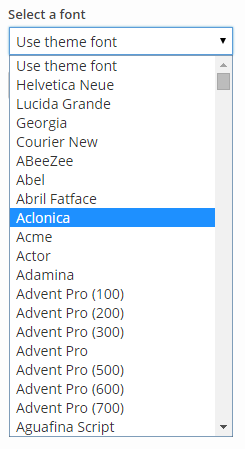
