# Form Fields

This is where you'll find a lot of the convenience of using the SiteOrigin Widgets Bundle as a framework for creating your own widgets. The widget form fields are a way for you to define the configuration fields you'd like to allow for your widget users. The more form fields you provide, the more customizable your widget becomes.

## Form Field Descriptors

The form fields options are returned as an array from the widget's `get_widget_form()` method, which is what the widgets in the Widgets Bundle use. They can also be passed into the `SiteOrigin_Widget` class constructor as an array; the constructor array is stored in the `$form_options` instance variable, and `get_widget_form()` is only used when that array is empty. Each value in the array is a form field descriptor, which is an associative array describing the form field to be rendered by the `SiteOrigin_Widget` base class, in order to capture configuration values for a widget instance. Each form field descriptor must at least have a type, however a few of the types won't be useful without additional configuration values. Optional base form field descriptor values are listed below:

- label: `string` Render a label for the field with the given value.
- default: `mixed` The field will be prepopulated with this default value.
- description: `string` Render small italic text below the field to describe the field's purpose.
- optional: `bool` Append '(Optional)' to this field's label as a small green superscript.
- required: `bool|string` Append '*' to this field's label and warn the user when they save the widget with this field empty. If this is a string, it is also shown as a message below the field.
- sanitize: `string|callable` Specifies sanitization type to be performed on non-empty input from this field. Available sanitizations are 'email', 'url', 'text' (removes HTML for users without the `unfiltered_html` capability) and 'number' (typecasts to an integer). A PHP callable is called with the value and, if the callable accepts it, the field's previous value. If the specified sanitization isn't recognized it is assumed to be a custom sanitization and a filter is applied using the pattern `'siteorigin_widgets_sanitize_field_' . $sanitize`, in case the sanitization is defined elsewhere. See [Input Sanitization](./input-sanitization.md).
- state_emitter, state_handler and state_handler_initial: `array` Show, hide or change fields based on the values of other fields. See [State Emitters](./state-emitters.md).

In addition to these, some fields have their own specific configuration values, which are listed in the respective sections below.

You can see all of these in action by installing and activating the SiteOrigin Widget Form Fields Demo plugin which can be found in the [so-dev-examples](https://github.com/siteorigin/so-dev-examples) repository.

## Form Field Types

### text
Renders a text input field.

#### Additional Options
- placeholder: `string` A string to display before any text has been input.
- readonly: `bool` If true, this field will not be editable.
- input_type: `string` The input type to use for this field. Supports all standard HTML input types. For a list avaliable types, [click here](https://developer.mozilla.org/en-US/docs/Web/HTML/Element/input).
- allow_html: `bool` Whether to keep HTML in the saved value. Defaults to `true`, which sanitizes the value with `wp_kses_post()`, so escape the value when you output it. If `false`, `sanitize_text_field()` is used.
- json: `bool` If true, the value is sanitized as JSON.
- onclick: `bool` If true, the value is sanitized as the JavaScript for an `onclick` attribute.
- width: `int` The width of the input in pixels.

The `allow_html`, `json` and `onclick` options also apply to the textarea and autocomplete fields. The `width` option also applies to the color, number, measurement and autocomplete fields.

#### Example
Form options input:
```php
$form_options = array(
	'some_text' => array(
		'type' => 'text',
		'label' => __( 'Some text goes here', 'siteorigin-docs' ),
		'default' => 'Some default text.'
	)
);
```
Result:

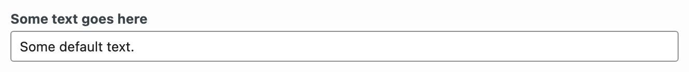

---

### link

Renders an input field for entering any URL and a button for convenient selection of content from public posts (except attachments). It's recommended that you output the URL using `sow_esc_url`. That will convert post id selections by the user to the full URL.

You can filter search results using the `siteorigin_widgets_search_posts_results` filter, and you can change the SQL Order By using the `siteorigin_widgets_search_posts_order_by` filter. For more information, [click here](./link-form-field-filters.md).

#### Additional Options
- placeholder: `string` A string to display before any text has been input.
- readonly: `bool` If true, this field will not be editable.
- post_types: `array` Array of strings post types by which to search.
- allow_shortcode: `bool` If true, a value containing `[` is kept as a shortcode instead of being escaped as a URL.

#### Example
Form options input:
```php
$form_options = array(
	'some_url' => array(
		'type' => 'link',
		'label' => __( 'Some URL goes here', 'siteorigin-docs' ),
		'default' => 'http://www.example.com'
	)
);
```
Result:

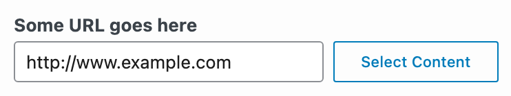

---

### color
Renders a color input field and color picker.

#### Additional options
- placeholder: `string` A string to display before any text has been input.
- alpha: `bool` If true, the color picker includes an opacity slider and the value can be an `rgba()` color.
- palettes: `array` An array of hex colors to show as swatches in the color picker. You can add swatches to every color field with the `siteorigin_widget_color_palette` filter.

#### Example
Form options input:
```php
$form_options = array(
	'some_color' => array(
		'type' => 'color',
		'label' => __( 'Choose a color', 'siteorigin-docs' ),
		'default' => '#bada55'
	)
);
```
Result:

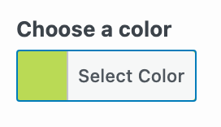

---

### number
Renders a text input field for entering a number. This is the same as the _text_ field, except that the input is cast as a `float`.

#### Additional Options
- placeholder: `string` A string to display before any text has been input.
- readonly: `bool` If true, this field will not be editable.
- abs: `bool` Whether to optionally apply the PHP function `abs` when saving to ensure only positive numbers are possible.
- min: `float` An optional minimum value allowed.
- max: `float` An optional maximum value allowed.
- step: `float` The step size of the number input.
- unit: `string` An optional unit of measurement shown to the user. This option will not be saved.

#### Example
Form options input:
```php
$form_options = array(
	'some_number' => array(
		'type' => 'number',
		'label' => __( 'Enter a number', 'siteorigin-docs' ),
		'default' => '12654',
		'unit' => 'px',
	)
);
```
Result:

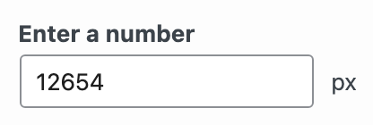

---

### measurement
Renders a field for entering a [unit of measurement](https://developer.mozilla.org/en-US/docs/Learn/CSS/Introduction_to_CSS/Values_and_units#Numeric_values). This is the same as the text field, except that the input includes unit of measurements.

#### Additional Options
- placeholder: `string` A string to display before any text has been input.
- readonly: `bool` If true, this field will not be editable.
- units: `array` An optional array of measurement units that will populate the drop down. Defaults to the list returned by `siteorigin_widgets_get_measurements_list()`.
- default_unit: `string` The default unit of measurement if the unit of measurement isn't able to be detected or is no longer present in the `units` array. Default to px.

#### Example
Form options input:


```php
$form_options = array(
	'example_size' => array(
		'type' => 'measurement',
		'label' => __( 'Size', 'siteorigin-docs' ),
		'default' => '10px',
	)
);
```

Result:

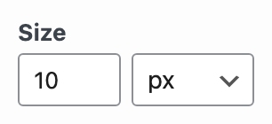

### multi-measurement
Renders multiple fields for entering [unit of measurement](https://developer.mozilla.org/en-US/docs/Learn/CSS/Introduction_to_CSS/Values_and_units#Numeric_values). This field type is typically used for things like margins, borders, and paddings.

#### Additional Options
- measurements: `array` The list of measurement options. Each item can be a label string or an array with the following keys:
-- label: `string` The label for the measurement input.
-- classes: `array` CSS classes to add to the measurement input.
-- units: `array` The selector units of measurement. If no units are set, default units are used - `px`, `%`, `in`, `cm`, `mm`, `em`, `rem`, `pt`, `pc`, `ex`, `ch`, `vw`, `vh`, `vmin`, `vmax`.
- separator: `string` separator for the measurements. Default is an empty space.
- autofill: `bool` Whether to automatically fill the rest of the inputs when the first value is entered. Default is false.

#### Example
Form options input:


```php
$useable_units = array( 'px', '%' );
$form_options = array(
	'padding' => array(
		'type' => 'multi-measurement',
		'autofill' => true,
		'default' => '5% 0px 25px 0px',
		'measurements' => array(
			'top' => array(
				'label' => __( 'Padding Top', 'siteorigin-docs' ),
				'units' => $useable_units,
			),
			'right' => array(
				'label' => __( 'Padding Right', 'siteorigin-docs' ),
				'units' => $useable_units,
			),
			'bottom' => array(
				'label' => __( 'Padding Bottom', 'siteorigin-docs' ),
				'units' => $useable_units,
			),
			'left' => array(
				'label' => __( 'Padding Left', 'siteorigin-docs' ),
				'units' => $useable_units,
			),
		),
	),
);
```

Result:

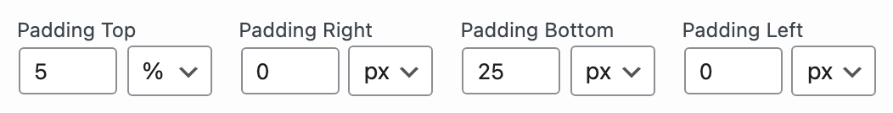

### multiple_media

Renders a media selector button that allows for multiple items to be selected. When clicked the button opens the WordPress Media Library dialog for the media types specified by the `library` option. Use `multiple_media`, with an underscore, as the field type; the field's JavaScript doesn't load for `multiple-media`.

#### Additional Options

- choose: `string` A label for the title of the media selector dialog.
- update: `string` A label for the confirmation button of the media selector dialog.
- library: `string` Sets the media library which to browse and from which media can be selected. Allowed MIME type values are `'image'`, `'audio'`, `'video'`, `'file'` and `'application'`, or a comma-separated list of them. Use `'all'` for every type. The default is `'image'`.
- title: `boolean` Whether to display the item title or not. Titles are displayed by default.
- thumbnail_dimensions: `array` The dimensions of each thumbnail item. Only used when editing widgets. The default dimensions are `array( 64, 64 )`.
- repeater: `array` An optional array containing information about a repeater field. This will allow for the multiple media field to add items to the repeater. For usage instructions, please refer to [this tutorial](./multiple-media-repeater.md)

#### Example

Form options input:

```php
$form_options = array(
	'images' => array(
		'type' => 'multiple_media',
		'label' => __( 'Multiple Media', 'siteorigin-docs' ),
		'library' => 'image',
		'thumbnail_dimensions' => array( 64, 64 ),
		'title' => true,
	),
);
```

Result:

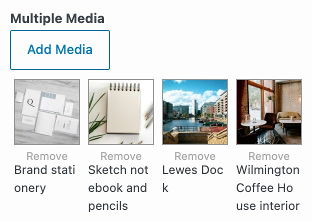

### textarea
Renders a textarea field.

#### Additional Options
- rows: `int` The number of visible rows in the textarea.
- placeholder: `string` A string to display before any text has been input.
- readonly: `bool` If true, this field will not be editable.

#### Example
Form options input:
```php
$form_options = array(
	'some_long_message' => array(
		'type' => 'textarea',
		'label' => __( 'Type a message', 'siteorigin-docs' ),
		'default' => 'An example of a long message.<br>It is even possible to add a few html tags.<br><a href="https://siteorigin.com" target="_blank">Links!</a><br><strong>Strong</strong> and <em>emphasized</em> text.',
		'rows' => 10
	)
);
```
Result:

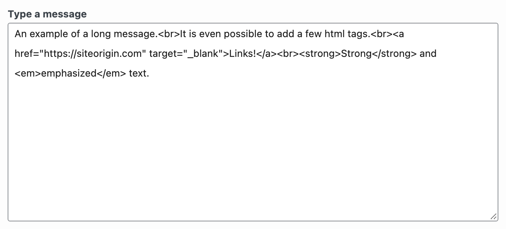

---

### tinymce
Renders a TinyMCE editor field.

#### Additional Options
- rows: `int` The number of visible rows in the textarea.
- default_editor: `string` Whether to display the TinyMCE visual editor or the Quicktags HTML editor initially. Allowed values are `'tinymce'` ( can be abbreviated to `'tmce'`), and `'html'`. The default is `'tinymce'`.
- media_buttons: `bool` Whether to add the Add Media button. The default is `true`.
- editor_height: `int` The initial height of the editor. Setting this will cause the rows option to be ignored.
- wpautop: `bool` Whether to add paragraphs with `wpautop()` when the value is saved from the visual editor. The default is `true`.
- mce_buttons, mce_buttons_2, mce_buttons_3, mce_buttons_4: `array` The buttons for each row of the TinyMCE visual editor.
- quicktags_buttons: `array` The buttons for the Quicktags HTML editor.
- mce_plugins: `array` The TinyMCE plugins to load.
- mce_external_plugins: `array` External TinyMCE plugins to load, as plugin name => script URL.
- button_filters: `array` An array of filter callbacks to filter the buttons available on the TinyMCE visual editor and the Quicktags HTML editor. Each callback must be a method of your widget, in the form `array( $this, 'method_name' )`. The TinyMCE editor can display up to four rows of buttons and the Quicktags editor displays a single row of buttons. Each row can be filtered by specifying a corresponding callback, as follows:
	* First row: `'mce_buttons'`
	* Second row: `'mce_buttons_2'`
	* Third row: `'mce_buttons_3'`
	* Fourth row: `'mce_buttons_4'`
	* Quicktags settings: `'quicktags_settings'`

#### Example
Form options input:
```php
$form_options = array(
	'some_tinymce_editor' => array(
		'type' => 'tinymce',
		'label' => __( 'Visually edit, richly.', 'siteorigin-docs' ),
		'default' => 'An example of a long message.<br>It is even possible to add a few html tags.<br><a href="https://siteorigin.com" target="_blank">Links!</a>',
		'rows' => 10,
		'default_editor' => 'html',
		'button_filters' => array(
			'mce_buttons' => array( $this, 'filter_mce_buttons' ),
			'mce_buttons_2' => array( $this, 'filter_mce_buttons_2' ),
			'mce_buttons_3' => array( $this, 'filter_mce_buttons_3' ),
			'mce_buttons_4' => array( $this, 'filter_mce_buttons_4' ),
			'quicktags_settings' => array( $this, 'filter_quicktags_settings' ),
		),
	)
);
```
Result:

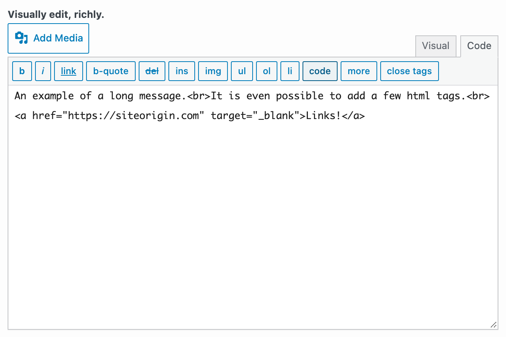

---

### slider
Renders a number slider field to allow the choice of a number in a range.

#### Additional options
- min: `float` The minimum value of the allowed range. The default is `0`.
- max: `float` The maximum value of the allowed range. The default is `100`.
- step: `float` The step size when moving in the range. The default is `1`.

#### Example
Form options input:
```php
$form_options = array(
	'some_number_in_a_range' => array(
		'type' => 'slider',
		'label' => __( 'Choose a number', 'siteorigin-docs' ),
		'default' => 24,
		'min' => 2,
		'max' => 37,
		'step' => 0.5,
	)
);
```
Result:

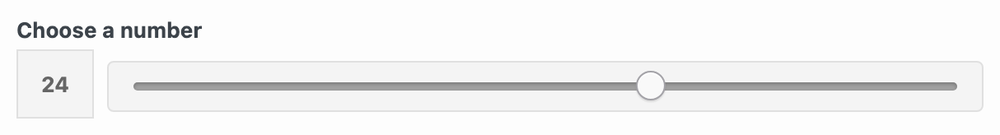

---

### order
Renders a list of options that the user can reorder. For usage, please refer to [this tutorial](./order-field.md)

#### Additional Options
- options: `array` The list of options which can be reordered
- default: `array` The keys of `options` in their initial order. This is required: the field only shows the keys in its value, so without a default listing every key it shows nothing.

#### Example
Form options input:
```php
$form_options = array(
	'ordering' => array(
		'type' => 'order',
		'label' => __( 'Element Order', 'siteorigin-docs' ),
		'options' => array(
			'section' => __( 'Section', 'siteorigin-docs' ),
			'divider' => __( 'Content', 'siteorigin-docs' ),
			'other section' => __( 'Other Section', 'siteorigin-docs' ),
		),
		'default' => array( 'section', 'divider', 'other section' ),
	),
);
```
Result:

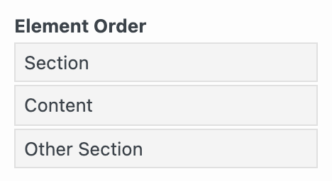

---
### select
Renders a dropdown select field. This field is better for a long list of predefined values. For a short list the radio input field is a better choice.

#### Additional Options
- prompt: `string` If present, it is included as a disabled (not selectable) value at the top of the list of options. If there is no default value, it is selected by default. You might even want to leave the label value blank when you use this.
- options `array` The list of options which may be selected.
- multiple `bool` Determines whether this is a single or multiple select field.
- select2 `bool` If enabled, [Select2](https://select2.org) will be enabled for the field.

The `prompt` option is ignored when `multiple` is enabled.

#### Example 1 - Default Value Without Prompt
Form options input:
```php
$form_options = array(
	'some_selection' => array(
		'type' => 'select',
		'label' => __( 'Choose a thing from a long list of things', 'siteorigin-docs' ),
		'default' => 'the_other_thing',
		'options' => array(
			'this_thing' => __( 'This thing', 'siteorigin-docs' ),
			'that_thing' => __( 'That thing', 'siteorigin-docs' ),
			'the_other_thing' => __( 'The other thing', 'siteorigin-docs' ),
		)
	)
);
```
Result:

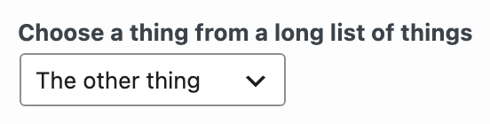

#### Example 2 - Prompt Without Default Value
Form options input:
```php
$form_options = array(
	'another_selection' => array(
		'type' => 'select',
		'prompt' => __( 'Choose a thing from a long list of things', 'siteorigin-docs' ),
		'options' => array(
			'this_thing' => __( 'This thing', 'siteorigin-docs' ),
			'that_thing' => __( 'That thing', 'siteorigin-docs' ),
			'the_other_thing' => __( 'The other thing', 'siteorigin-docs' ),
		)
	)
);
```
Result:

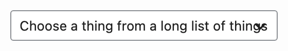

#### Example 3 - Multiple Select
Form options input:
```php
$form_options = array(
	'another_selection' => array(
		'type' => 'select',
		'label' => __( 'Choose a thing from a long list of things', 'siteorigin-docs' ),
		'multiple' => true,
		'default' => 'the_other_thing',
		'options' => array(
			'this_thing' => __( 'This thing', 'siteorigin-docs' ),
			'that_thing' => __( 'That thing', 'siteorigin-docs' ),
			'the_other_thing' => __( 'The other thing', 'siteorigin-docs' ),
		)
	)
);
```
Result:

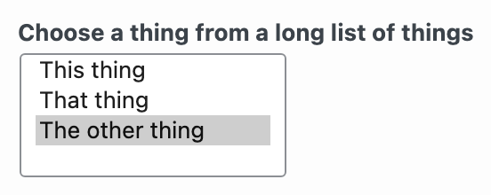

---

### checkbox
Renders a checkbox field.

#### Example
Form options input:
```php
$form_options = array(
	'some_boolean' => array(
		'type' => 'checkbox',
		'label' => __( 'Allow this thing?', 'siteorigin-docs' ),
		'default' => true
	)
);
```
Result:

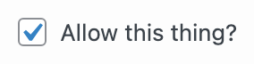

---

### checkboxes
Renders a series of checkboxes.

#### Additional Options
- options `array` The list of options which may be selected.

#### Example
Form options input:

```php
$form_options = array(
	'potential_options' => array(
		'type' => 'checkboxes',
		'label' => __( 'Allow this thing?', 'siteorigin-docs' ),
		'options' => array(
			'option' =>  __( 'value', 'siteorigin-docs' ),
			'other option' =>  __( 'other value', 'siteorigin-docs' ),
			'another additional option' => __( 'Another possible value', 'siteorigin-docs' )
		),
	)
);
```

Result:

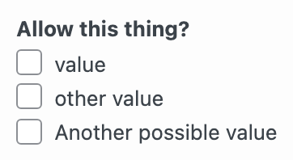

### radio
Renders a radio input field. This field is better for a short list of predefined values. For a long list the dropdown select field is a better choice.

#### Additional options
- options `array` The list of options which may be selected.

#### Example
Form options input:
```php
$form_options = array(
	'radio_selection' => array(
		'type' => 'radio',
		'label' => __( 'Choose a thing from a short list of things', 'siteorigin-docs' ),
		'default' => 'that_thing',
		'options' => array(
			'this_thing' => __( 'This thing', 'siteorigin-docs' ),
			'that_thing' => __( 'That thing', 'siteorigin-docs' ),
			'the_other_thing' => __( 'The other thing', 'siteorigin-docs' )
		)
	)
);
```
Result:

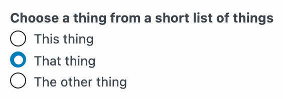

---

### media
Renders a media selector button. When clicked the button opens the WordPress Media Library dialog for the media types specified by the `library` option.

#### Additional Options
- choose: `string` A label for the title of the media selector dialog.
- update: `string` A label for the confirmation button of the media selector dialog.
- library: `string` Sets the media library which to browse and from which media can be selected. Allowed MIME type values are `'image'`, `'audio'`, `'video'`, `'file'` and `'application'`, or a comma-separated list of them. Use `'all'` for every type. The default is `'image'`.
- fallback: `bool` Whether or not to display a URL input field which allows for specification of a fallback URL to be used in case the selected media resource isn't available. The fallback URL is saved in the instance under `{field name}_fallback`, for example `some_media_fallback`.
- image_search: `string` The label for the Image Search button. The button only shows when `library` is `'image'` and the user can upload files.

#### Example
Form options input:
```php
$form_options = array(
	'some_media' => array(
		'type' => 'media',
		'label' => __( 'Choose a media thing', 'siteorigin-docs' ),
		'choose' => __( 'Choose image', 'siteorigin-docs' ),
		'update' => __( 'Set image', 'siteorigin-docs' ),
		'library' => 'image',
		'fallback' => true
	)
);
```
Result:

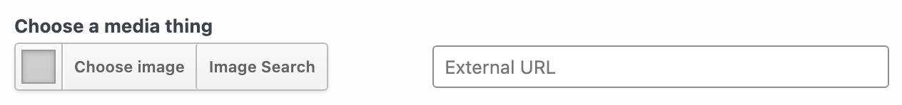

---

### image size
Renders a dropdown with all of [the available image sizes](https://developer.wordpress.org/reference/functions/add_image_size/) on the widget users website. This field is commonly used in conjunction with the Media field to allow the user more control over the image output. Please refer to the [Image Sizes tutorial](./image-sizes-field.md) for usage instructions.


#### Additional Options
- custom_size: `bool` Whether to allow custom image sizes. By default, Custom Sizes are disabled.
- custom_size_enforce: `bool` If true, a custom size also shows an **Enforce Dimensions** checkbox, saved as `{field name}_enforce`.
- sizes: `array` A list of image sizes to show, as size name => label, in place of all registered sizes.

#### Example
```php
$form_options = array(
	'size' => array(
		'type' => 'image-size',
		'label' => __( 'Image size', 'siteorigin-docs' ),
	)
);
```
Result:

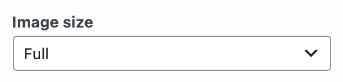

Possible Image Size values:

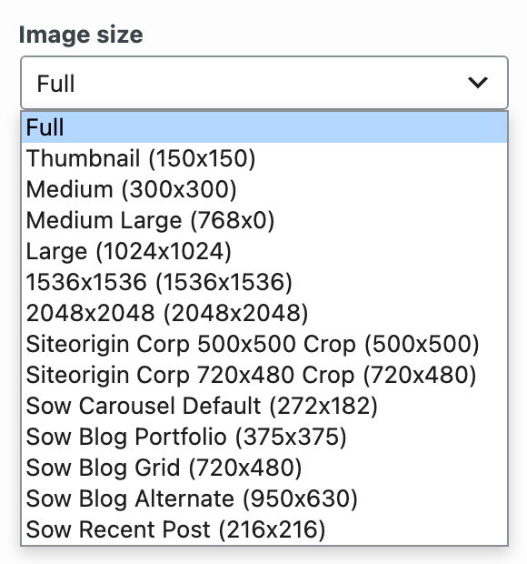

#### Custom Image Size
The custom_size option allows the user to manually input an image size. The custom image size values are prefixed with the option name and then \_width or \_height. For example: `option_name_width` and `option_name_height`.

For this image size to be used you'll need to detect the size form field value equals to `custom_size` and then pass an array with the field values. For example:

```php
<?php
// Detect custom image size and override size.
if (
	$instance['size'] == 'custom_size' &&
	! empty( $instance['size_width'] ) &&
	! empty( $instance['size_height'] )
) {
	$instance['size'] = array(
		(int) $instance['size_width'],
		(int) $instance['size_height'],
	);
}

$src = siteorigin_widgets_get_attachment_image_src(
	$instance['image'], // Set elsewhere
	$instance['size']
);
```
### posts
Renders a post selector field. This can be used to build custom queries with which to select posts from your database. The field displays a small red indicator which shows the number of posts currently being selected. By default, all posts of the `post` post type are selected.

You can find more detail about the use of the post selector field [here](./post-selector.md).


#### Additional Options
- show_count: `bool` Whether to add query total results count to the posts section title in the editor. Defaults to true.
- post_types: `array` Limits the post types in the **Post Type** list.
- posts_limit: `bool` If true, the field adds a **Maximum Posts to Output** setting.

#### Example
Form options input:
```php
$form_options = array(
	'some_posts' => array(
		'type' => 'posts',
		'show_count' => true,
		'label' => __( 'Some posts query', 'siteorigin-docs' ),
	)
);
```
Result:

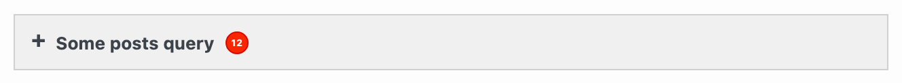


---

### section
The section field type provides a convenient way to group and hide related form fields. This is useful when you have a large form which can appear overwhelming.

#### Additional Options
- hide: `bool` Whether or not this section should start out collapsed or expanded.
- fields: `array` The set of fields to be grouped together. This should contain any combination of other field types, even repeaters and sections.
- tab: `bool` If true, the section is shown as a tab of a tabs field. See [tabs](#tabs).

#### Example
Form options input:
```php
$form_options = array(
	'a_section' => array(
		'type' => 'section',
		'label' => __( 'A section containing related fields.' , 'siteorigin-docs' ),
		'hide' => true,
		'fields' => array(
			'grouped_text' => array(
				'type' => 'text',
				'label' => __( 'A grouped text field', 'siteorigin-docs' )
			),
			'grouped_checkbox' => array(
				'type' => 'checkbox',
				'label' => __( 'A grouped checkbox', 'siteorigin-docs' )
			)
		)
	)
);
```
Result:

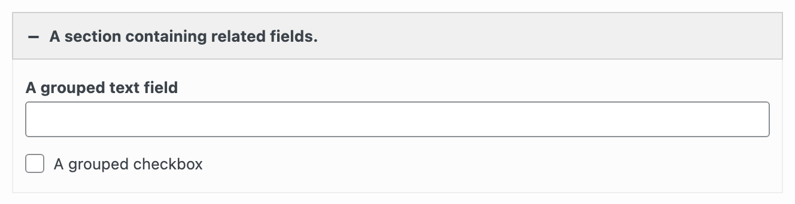

---

### tabs
The tabs field integrates with the section field. By itself, this field doesn't function and must be paired with a section field as each tab corresponds to an assigned section. On mobile devices, the tabs will disappear in favor of the original sections.

This field requires Widgets Bundle version 1.50.1 or higher. If the user is using a version prior to that release, the sections will output as normal.

#### Options
- tabs: `array` This associative array contains the section id and label of the section to display as a tab. The section label doesn't have to be the same as the section.

```php

add_filter( 'siteorigin_widgets_form_options_sow-editor', function( $form_options ) {
	if ( empty( $form_options ) ) {
		return $form_options;
	}

	$form_options['tabs'] = array(
		'type' => 'tabs',
		'tabs' => array(
			'example_section' => __( 'Example Section', 'siteorigin-docs' ),
			'another_example' => __( 'Second Example', 'siteorigin-docs' ),
		),
	);

	$form_options['example_section'] = array(
		'type' => 'section',
		'label' => __( 'Example Section' , 'siteorigin-docs' ),
		'tab' => true,
		'hide' => true,
		'fields' => array(
			'test' => array(
				'type' => 'html',
				'markup' => __( 'First tab', 'siteorigin-docs' ),
			),
		),
	);


	$form_options['another_example'] = array(
		'type' => 'section',
		'label' => __( 'The Tab label defined above will be output instead of this' , 'siteorigin-docs' ),
		'tab' => true,
		'hide' => true,
		'fields' => array(
			'test' => array(
				'type' => 'html',
				'markup' => __( 'Second tab', 'siteorigin-docs' ),
			),
		),
	);


	return $form_options;
} );
```

Result:
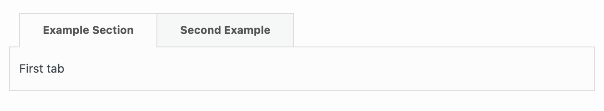

---

### repeater
The repeater field type provides a convenient way to repeat a specified set of form fields.

#### Additional Options
- item_name: `string` A default label for each repeated item.
- item_label: `array` This associative array describes how the repeater may retrieve the item labels from HTML elements as they are updated. The options are:
  - selector: `string` A JQuery selector which is used to find an element from which to retrieve the item label.
  - update_event: `string` The javascript event on which to bind and update the item label.
  - value_method: `string` The javascript function which should be used to retrieve the item label from an element.
- fields: `array` The set of fields to be repeated together as one item. This should contain any combination of other field types, even repeaters and sections.
- scroll_count: `int` The maximum number of repeated items to display before adding a scrollbar to the repeater.
- readonly: `bool` Whether or not items may be added to or removed from this repeater by user interaction.
- max_items: `int` The maximum number of items. See [Repeaters and Sections](./repeaters-and-sections.md).

#### Example
Form options input:
```php
$form_options = array(
	'a_repeater' => array(
		'type' => 'repeater',
		'label' => __( 'A repeating repeater.' , 'siteorigin-docs' ),
		'item_name'  => __( 'Repeater item', 'siteorigin-docs' ),
		'item_label' => array(
			'selector'     => "[id*='repeat_text']",
			'update_event' => 'change',
			'value_method' => 'val'
		),
		'fields' => array(
			'repeat_text' => array(
				'type' => 'text',
				'label' => __( 'A text field in a repeater item.', 'siteorigin-docs' )
			),
			'repeat_checkbox' => array(
				'type' => 'checkbox',
				'label' => __( 'A checkbox in a repeater item.', 'siteorigin-docs' )
			)
		)
	)
);
```
Result:

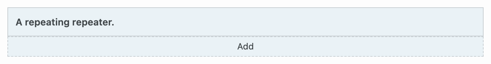

Repeater containing two items (the first item is collapsed and the second item is expanded):

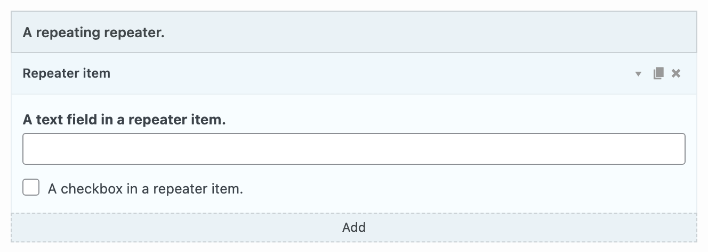

---

### widget
Includes the entire form of an existing widget class. You can [find more information about using child widgets here](./child-widgets.md).

#### Additional Options
- class: `string` The class name of the widget to be included.
- hide: `bool` Whether or not this widget's form section should start out collapsed or expanded.
- form_filter: `callable` A callback that receives the child widget's form options and returns a filtered array. See [Child Widgets](./child-widgets.md).
- collapsible: `bool` Whether the child widget's form is in a collapsible section. The default is `true`.

#### Example
Form options input:
```php
$form_options = array(
	'some_widget' => array(
		'type' => 'widget',
		'label' => __( 'Button Widget', 'siteorigin-docs' ),
		'class' => 'SiteOrigin_Widget_Button_Widget',
		'hide' => true
	)
);
```
Result:

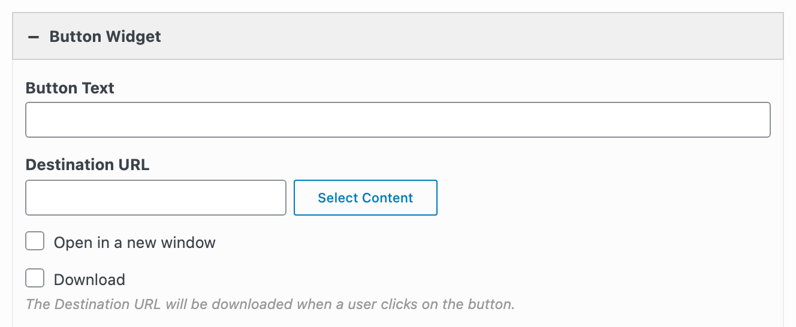

---

### builder
An entire [SiteOrigin Page Builder](https://wordpress.org/plugins/siteorigin-panels/) instance. For usage, please refer to [this tutorial](./builder-field.md)

_This field requires [SiteOrigin Page Builder](https://wordpress.org/plugins/siteorigin-panels/) to be installed and active._

#### Additional Options
-  builder_type: `string` The type of Page Builder instance, output as the builder's `data-type` attribute. Defaults to `sow-builder-field`.

#### Example
Form options input:

```php
$form_options = array(
	'page_builder' => array(
		'type' => 'builder',
		'label' => __( 'Page Builder', 'siteorigin-docs'),
	)
);
```

Result:

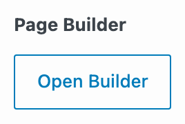

### code
A textarea field with the [Behave.js library](https://github.com/jakiestfu/Behave.js) set up for it.

The code field doesn't sanitize its value and ignores the `sanitize` option, so your widget must sanitize and escape the value itself.

#### Additional options
- rows: `int` The number of visible rows in the textarea.
- placeholder: `string` A string to display before any text has been input.
- readonly `bool` If true, this field will not be editable.

#### Example
Form options input:

```php
$form_options = array(
	'code_editor' => array(
		'type' => 'code',
		'label' => __( 'Code Editor', 'siteorigin-docs' ),
	)
);
```

Result:

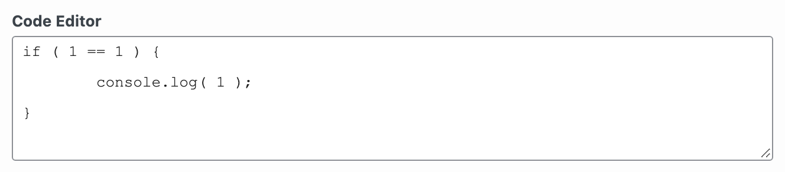

---

### icon
Renders an icon selector field. This allows you to select an icon from a default set of icon families, namely <a href="http://fortawesome.github.io/Font-Awesome/" target="_blank">Font Awesome</a>, <a href="https://icomoon.io/" target="_blank">IcoMoon</a>, <a href="http://genericons.com/" target="_blank">Genericons</a>, <a href="http://typicons.com/" target="_blank">Typicons</a>, <a href="http://www.elegantthemes.com/blog/freebie-of-the-week/free-line-style-icons" target="_blank">Elegant Themes' Line Icons</a>, <a href="https://fonts.google.com/icons" target="_blank">Google Material Icons / Symbols</a> and <a href="https://ionic.io/ionicons" target="_blank">Ionicons</a>. You can include your own icon families with the `siteorigin_widgets_icon_families` filter.

You can find more detail about using icons [here](./icons-and-fonts.md).

#### Additional Options
- icons_callback: `callable` A callback that returns the icon families to offer, in place of all families from the `siteorigin_widgets_icon_families` filter.
- rows: `int` The number of rows of icons to show. The default is `3`.

#### Example
Form options input:
```php
$form_options = array(
	'some_icon' => array(
		'type' => 'icon',
		'label' => __( 'Select an icon', 'siteorigin-docs' ),
	)
);
```
Result:

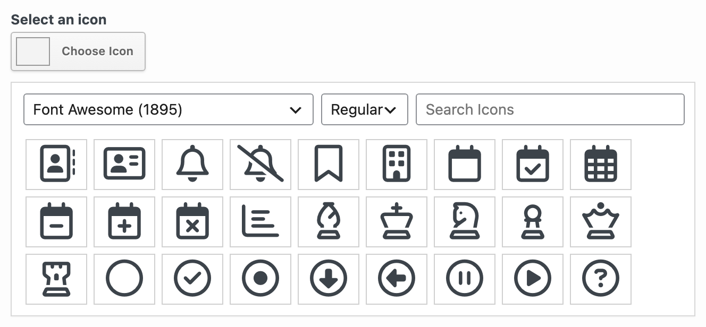

---

### font
Renders a font selector field. This allows you to select a font from a default set of font families, namely the web safe fonts (Arial, Courier New, Georgia, Helvetica Neue, Lucida Grande and Times New Roman) and a selection of font families from the Google Fonts library. By default this field will use the font specified by the active theme.

You can include your own font families with the `siteorigin_widgets_font_families` filter. You can find more detail about extending available fonts [here](./icons-and-fonts.md).

#### Example
Form options input:
```php
$form_options = array(
	'some_font' => array(
		'type' => 'font',
		'label' => __( 'Select a font', 'siteorigin-docs' ),
	)
);
```
Result:

Default selection:
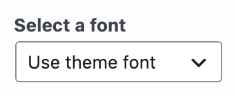

Selecting a font:
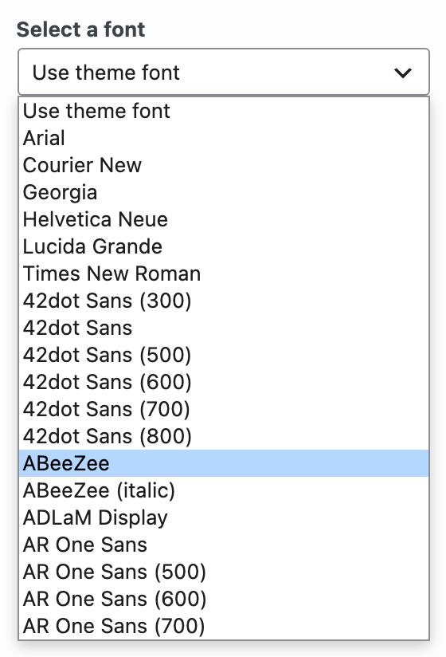

### presets

The presets field allows you to create presets for your widget. You can [find more information about using presets here](./presets.md).

#### Options

- options `array` A multidimensional array containing your presets data.
- default_preset `string` Which preset to load automatically. This is optional, and if it is not set, an empty default option will be added to the presets select.

#### Example

Form options input:

```php
$form_options = array(
	'presets' => array(
		'type' => 'presets',
		'label' => __( 'Theme', 'siteorigin-docs' ),
		'default_preset' => 'test-2',
		'options' => array(
			'test' => array( // Preset 1
				'label' => 'Test 1',
				'values' => array(
					'test' => 'Test 1 example text',
				),
			),
			'test-2' => array(  // Preset 2
				'label' => 'Test 2',
				'values' => array(
					'test' => 'Test 1 example text',
					'color' => '#0f0',
				),
			),
		),
	),
);
```

Result:

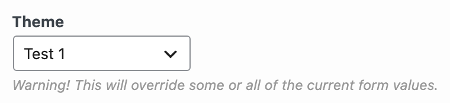

### html

The HTML field allows you to directly output HTML. This is useful for conveying information that is better served being separate rather than in a field description, giving a brief for a section, etc.

This field requires Widgets Bundle version Widgets Bundle 1.44.0 or higher. If the user is using a version prior to that release, nothing will output.

#### Options

- markup `string` A string containing HTML to output.

#### Example

This example will add two HTML fields to the end of the SiteOrgin Editor widget. The first will display a box with some inline styling and the second will add the SiteOrigin logo.

```php
add_filter( 'siteorigin_widgets_form_options_sow-editor', function( $form_options ) {
	if ( empty( $form_options ) ) {
		return $form_options;
	}

	// This go anywhere in the `$form_options` array.
	$form_options['html_button_example'] = array(
		'type' => 'html',
		'markup' => '<span style="border: 1px solid #000; padding: 5px; margin: 21px; display: inline-block;">' . __( 'Box with inline styling', 'siteorigin-docs' ) . '</span>',
	);

	$form_options['siteorigin_logo'] = array(
		'type' => 'html',
		'label' => __( 'SiteOrigin Logo HTML Example' , 'siteorigin-docs' ),
		'markup' => '',
	);

	return $form_options;
} );

```

Result:

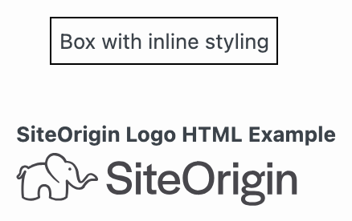

### Autocomplete

The Autocomplete field provides a list of posts or terms users that the user can select from. When an item is selected, the post ID, or the term as `taxonomy:slug`, will be inserted. If multiple are selected each selection will be separated by a comma.

#### Options

- post_types `array` An array of post types to use in the autocomplete query. Only used for posts. Default is posts.
- source `string` Indicates which database table will be used to retrieve autocomplete suggestions. Options are `posts` and `terms`. Default is posts. The field sends its search to the `so_widgets_search_{source}` AJAX action.
- multiple `bool` Whether to allow multiple items to be selected. Default is true.
- ajax_data `array` Extra parameters to send with the autocomplete AJAX request.

#### Example

```php
$form_options = array(
	'example' => array(
		'type' => 'autocomplete',
		'label' => __( 'Pages', 'siteorigin-docs'),
		'post_types' => array(
			'page'
		),
	),
);
```

Result:

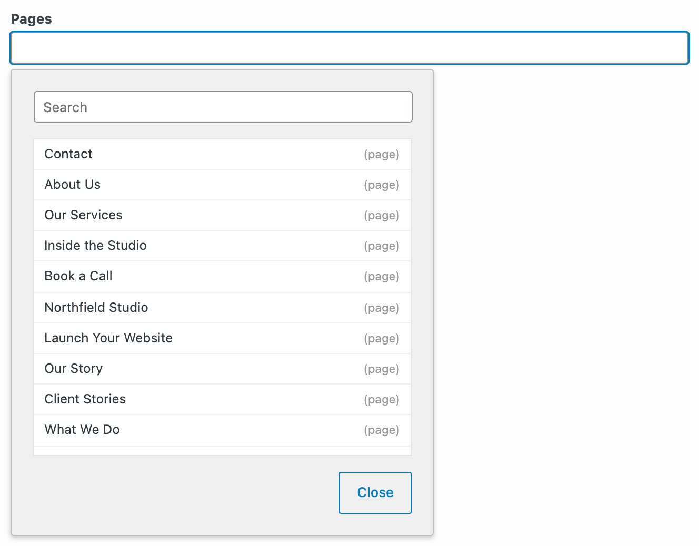

---

### toggle
Renders an on/off switch. The fields inside the toggle are shown when the switch is on. The toggle saves its fields like a section and stores the switch state as `so_field_container_state`, which is `'open'` when the switch is on.

#### Additional Options
- fields: `array` The fields to show when the switch is on.
- toggle_on: `string` The label for the on position. The default is "On".
- toggle_off: `string` The label for the off position. The default is "Off".
- hide: `bool` Whether the switch starts in the off position.

#### Example
Form options input:
```php
$form_options = array(
	'shadow' => array(
		'type' => 'toggle',
		'label' => __( 'Shadow', 'siteorigin-docs' ),
		'hide' => true,
		'fields' => array(
			'color' => array(
				'type' => 'color',
				'label' => __( 'Shadow color', 'siteorigin-docs' ),
			),
		),
	),
);
```

In your template, check the state before you use the fields:

```php
if (
	! empty( $instance['shadow']['so_field_container_state'] ) &&
	$instance['shadow']['so_field_container_state'] === 'open'
) {
	// Use $instance['shadow']['color'] here.
}
```

---

### image-radio
Renders a set of radio buttons with an image for each option.

#### Additional Options
- options: `array` The options, as value => `array( 'image' => image URL, 'label' => label text )`.
- layout: `string` Either `vertical` or `horizontal`. The default is `vertical`.

#### Example
Form options input:
```php
$form_options = array(
	'layout' => array(
		'type' => 'image-radio',
		'label' => __( 'Layout', 'siteorigin-docs' ),
		'default' => 'left',
		'layout' => 'horizontal',
		'options' => array(
			'left' => array(
				'label' => __( 'Image left', 'siteorigin-docs' ),
				'image' => plugin_dir_url( __FILE__ ) . 'images/left.svg',
			),
			'right' => array(
				'label' => __( 'Image right', 'siteorigin-docs' ),
				'image' => plugin_dir_url( __FILE__ ) . 'images/right.svg',
			),
		),
	),
);
```

---

### Other field types
The Widgets Bundle also includes the `date-range` field (set `date_type` to `specific` or `relative`), used by the post selector, and the `image_shape` field, used by the Image Widget's **Image Shape** setting. Use the `image_shape` spelling, with an underscore, because the field's JavaScript doesn't load for `image-shape`.
