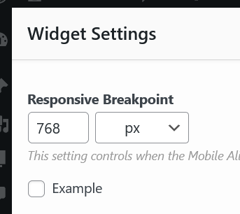

# Global Widget Settings

You can add global settings for your widget by adding the `get_settings_form` method to your widget and returning a standard [forms](./form-fields.md) array. These settings are accessed by the user navigating to via **Plugins > SiteOrigin Widgets** and then clicking your widgets respective Settings button.

### Example
The following example adds an example checkbox global setting to this widget's global settings.

```php
class MyCustomWidget extends SiteOrigin_Widget {
	// We're leaving out all the setup code here

	function get_settings_form( $form ) {
		// We can modify this $form array however we want
		$form['example'] = array(
			'type' => 'checkbox',
			'label' => __('Example', 'example'),
		);
		return $form;
	}
}
```

### Retrieving a widget's global settings.
The `SiteOrigin_Widget` class includes a utility method called `get_global_settings` you can use to retrieve your global settings. It features an optional string parameter that allows you to retrieve a specific setting. If this parameter isn't set, all settings are returned. The following example snippets

```php
class MyCustomWidget extends SiteOrigin_Widget {
    // We're leaving out all the setup code here
    
    function modify_instance( $form ) {

        // Retrieve all settings.
        $global_settings = $this->get_global_settings();

		if ( ! empty( $global_settings['example'] ) ) {
			// Global example setting is enabled. Do something here.
		}

        return $form;
    }
}
```

### Retrieving a specific widget global setting.
The `get_global_settings` method features an optional string parameter that allows you to retrieve a specific setting. If this parameter isn't set, all settings are returned. Below is the above snippet modified to use this paramater.

```php
class MyCustomWidget extends SiteOrigin_Widget {
    // We're leaving out all the setup code here
    
    function modify_instance( $form ) {

		if ( ! empty( $$this->get_global_settings( 'example' ) ) ) {
			// Global example setting is enabled. Do something here.
		}

        return $form;
    }
}
```

### Add global defaults to other widgets
The `siteorigin_widgets_settings_form` filter can be used to alter the global settings of a widget. You can target specific widgets by prefixing the widget id to the end of the snippet. For example, you can target the SiteOrigin Button widget using: `siteorigin_widgets_settings_form_sow-button`

The following snippet will add an example checkbox to the SiteOrigin Button widget.

```php
add_filter( 'siteorigin_widgets_settings_form_sow-button', function( $form_options ) {
	$form_options['example'] = array(
		'type' => 'checkbox',
		'label' => __('Example', 'example'),
	);

	return $form_options;
} );
```

Result

