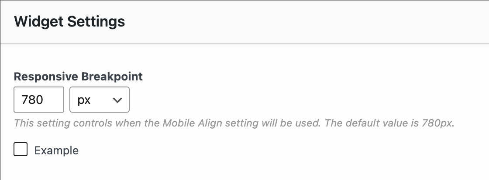

# Global Widget Settings

You can add global settings for your widget by adding the `get_settings_form` method to your widget and returning a standard [forms](./form-fields.md) array. These settings are accessed by the user navigating to **Plugins > SiteOrigin Widgets** and then clicking your widgets respective Settings button.

### Example
The following example adds an example checkbox global setting to this widget's global settings.

```php
class MyCustomWidget extends SiteOrigin_Widget {
	// We're leaving out all the setup code here.

	public function get_settings_form() {
		return array(
			'example' => array(
				'type' => 'checkbox',
				'label' => __( 'Example', 'siteorigin-docs' ),
			),
		);
	}
}
```

### Retrieving a Widget’s Global Settings
The `SiteOrigin_Widget` class includes a utility method called `get_global_settings` you can use to retrieve your global settings. It features an optional string parameter that allows you to retrieve a specific setting. If this parameter isn't set, all settings are returned. The following example snippet fetches the widget's global settings and then checks for our example checkbox.

```php
class MyCustomWidget extends SiteOrigin_Widget {
	// We're leaving out all the setup code here.

	public function modify_instance( $instance ) {

		// Retrieve all settings.
		$global_settings = $this->get_global_settings();

		if ( ! empty( $global_settings['example'] ) ) {
			// Global example setting is enabled. Do something here.
		}

		return $instance;
	}
}
```

### Retrieving a Specific Widget Global Setting
The `get_global_settings` method features an optional string parameter that allows you to retrieve a specific setting. If this parameter isn't set, all settings are returned. Below is the above snippet modified to use this parameter.

```php
class MyCustomWidget extends SiteOrigin_Widget {
	// We're leaving out all the setup code here.

	public function modify_instance( $instance ) {

		if ( ! empty( $this->get_global_settings( 'example' ) ) ) {
			// Global example setting is enabled. Do something here.
		}

		return $instance;
	}
}
```

### Add Global Defaults to Other Widgets
The `siteorigin_widgets_settings_form` filter can be used to alter the global settings of a widget. You can target a specific widget by appending its `id_base` to the filter name. For example, you can target the SiteOrigin Button Widget using: `siteorigin_widgets_settings_form_sow-button`

Both filters also pass the widget object as a second argument. The following snippet will add an example checkbox to the SiteOrigin Button Widget.

```php
add_filter( 'siteorigin_widgets_settings_form_sow-button', function( $form_options ) {
	$form_options['example'] = array(
		'type' => 'checkbox',
		'label' => __( 'Example', 'siteorigin-docs' ),
	);

	return $form_options;
} );
```

Result

