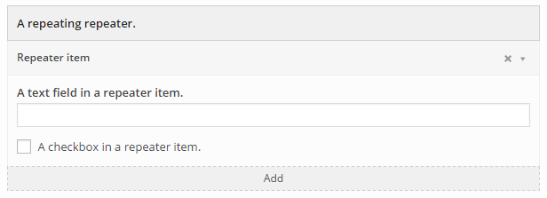
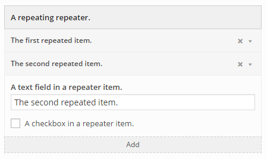

# Repeaters and sections
## Repeaters
### Basic usage
Repeaters provide a way to repeat a group of form fields any number of times. The group of fields to be repeated are specified similarly to a section. Initially the repeater is empty and only displays the header label and the 'Add' button. When the user clicks the 'Add' button, an item containing the specified group of fields is added to the repeater in it's collapsed state, where only the item label, remove button and expand/collapse toggle are visible. Clicking anywhere on this item header, except on the remove button, will toggle the expanded/collapsed state. Clicking on the remove button will trigger a warning asking the user to confirm the action and then, on confirmation, remove the item from the repeater.
 
### Example 1 - Basic usage
Form options input:
```php
$form_options = array(
	'a_repeater' => array(
		'type' => 'repeater',
		'label' => __( 'A repeating repeater.' , 'widget-form-fields-text-domain' ),
		'item_name'  => __( 'Repeater item', 'siteorigin-widgets' ),
		'fields' => array(
			'repeat_text' => array(
				'type' => 'text',
				'label' => __( 'A text field in a repeater item.', 'widget-form-fields-text-domain' )
			),
			'repeat_checkbox' => array(
				'type' => 'checkbox',
				'label' => __( 'A checkbox in a repeater item.', 'widget-form-fields-text-domain' )
			)
		)
	)
);
```
Result:

Empty repeater:


Repeater with newly added collapsed item.


Repeater with expanded item.


The resulting input is then grouped in an indexed array on the widget instance and can be accessed using the key given for the repeater when first initializing form options. For the above example, the repeater item fields can be accessed in the `get_template_variables` function, as follows:
```php
get_template_variables( $instance, $args ) {
	$joined_text = '';
    // Ensure that the repeater is available and not empty.
    if ( ! empty( $instance['a_repeater'] ) ) {
    	$repeater_items = $instance['a_repeater'];
    	foreach( $repeater_items as $index => $repeater_item ) {
    		$text_from_repeater_item_text_field = $repeater_item['repeat_text'];
    		$joined_text .= $text_from_repeater_item_text_field;
    		$boolean_from_repeater_item_checkbox = $repeater_item['repeat_checkbox'];
        }
    }
    return array(
    	'joined_text' => !empty( $joined_text ) ? $joined_text : 'A default string'
    );
}
```

### Using item labels
By default, repeaters use the 'item_name' value as the item label in item headers. Repeaters can be configured to use a specific input field's value as the item label, which is displayed in the item header. This is done using the 'item_label' configuration value, which is an associative array that describes how the repeater may retrieve the item labels from an HTML elements as it is updated. It requires three properties, namely:
- selector: `string` A JQuery selector which is used to find an element from which to retrieve the item label. Any JQuery selector is valid here.
- update_event: `string` The javascript event on which to bind and update the item label. Defaults to 'change' event.
- value_method: `string` The javascript function which should be used to retrieve the item label from an element. Defaults to `val()` method.

### Example 2 - Using item labels
Form options input:
```php
$form_options = array(
	'a_repeater' => array(
		'type' => 'repeater',
		'label' => __( 'A repeating repeater.' , 'widget-form-fields-text-domain' ),
		'item_name'  => __( 'Repeater item', 'siteorigin-widgets' ),
		'item_label' => array(
			'selector'     => "[id*='repeat_text']",
			'update_event' => 'change',
			'value_method' => 'val'
		),
		'fields' => array(
			'repeat_text' => array(
				'type' => 'text',
				'label' => __( 'A text field in a repeater item.', 'widget-form-fields-text-domain' )
			),
			'repeat_checkbox' => array(
				'type' => 'checkbox',
				'label' => __( 'A checkbox in a repeater item.', 'widget-form-fields-text-domain' )
			)
		)
	)
);
```

In the above example the repeater has been configured to use the 'repeat_text' field value as the item label. The result can be seen in the below image.

Repeater containing two items using the `item_label` property:



---

## Sections
Sections simply allow the user to better organize fields and to hide a group of fields when not in use. This improves user experience by simplifying the appearance of large forms.

### Example
Form options input:
```php
$form_options = array(
	'a_section' => array(
		'type' => 'section',
		'label' => __( 'A section containing related fields.' , 'widget-form-fields-text-domain' ),
		'hide' => true,
		'fields' => array(
			'grouped_text' => array(
				'type' => 'text',
				'label' => __( 'A grouped text field', 'widget-form-fields-text-domain' )
			),
			'grouped_checkbox' => array(
				'type' => 'checkbox',
				'label' => __( 'A grouped checkbox', 'widget-form-fields-text-domain' )
			)
		)
	)
);
```
Result:


The resulting input is then grouped in an associative array on the widget instance and can be accessed using the key given for the section when first initializing form options. For the above example, the `grouped_text` fields can be retrieved in the `get_template_variables` function, as follows:
```php
get_template_variables( $instance, $args ) {
    // Ensure that the group and field in the group are actually available.
    if ( ! empty( $instance['a_section'] ) && ! empty ( $instance['a_section']['grouped_text'] ) ) {
        $text_from_grouped_text = $instance['a_section']['grouped_text'];
    }
    
    return array(
    	'a_text_thing' => ! empty( $text_from_grouped_text ) ? $text_from_grouped_text : 'A default string'
    );
}
```
