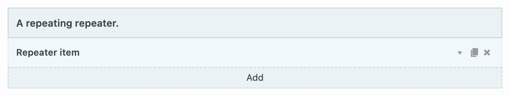
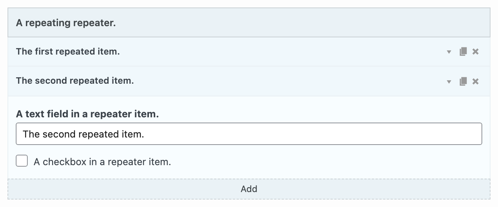

# Repeaters and Sections

## Repeaters

A repeater lets users add a group of fields as many times as they need, such as one group per slide or per feature. You declare the repeated fields the same way as a section's fields.

A new repeater is empty and shows its label and an **Add** button. Each click on **Add** adds an item, collapsed, with its label, a remove button and an expand toggle in its header. Clicking the header, anywhere except the remove button, expands or collapses the item. Clicking the remove button asks the user to confirm, then removes the item.

### Example

```php
$form_options = array(
	'a_repeater' => array(
		'type' => 'repeater',
		'label' => __( 'A repeating repeater.' , 'siteorigin-docs' ),
		'item_name'  => __( 'Repeater item', 'siteorigin-docs' ),
		'fields' => array(
			'repeat_text' => array(
				'type' => 'text',
				'label' => __( 'A text field in a repeater item.', 'siteorigin-docs' )
			),
			'repeat_checkbox' => array(
				'type' => 'checkbox',
				'label' => __( 'A checkbox in a repeater item.', 'siteorigin-docs' )
			)
		)
	)
);
```

An empty repeater:


A repeater with a new, collapsed item:



A repeater with an expanded item:


The widget instance stores the items as an indexed array under the repeater's key. This example reads the items in `get_template_variables()`:

```php
public function get_template_variables( $instance, $args ) {
	$joined_text = '';
    // Ensure that the repeater is available and not empty.
    if ( ! empty( $instance['a_repeater'] ) ) {
    	$repeater_items = $instance['a_repeater'];
    	foreach( $repeater_items as $index => $repeater_item ) {
    		$text_from_repeater_item_text_field = $repeater_item['repeat_text'];
    		$joined_text .= $text_from_repeater_item_text_field;
    		$boolean_from_repeater_item_checkbox = $repeater_item['repeat_checkbox'];
        }
    }
    return array(
    	'joined_text' => !empty( $joined_text ) ? $joined_text : 'A default string'
    );
}
```

### Item Labels

Each item's header shows the repeater's `item_name`. The `item_label` option shows the value of one of the item's fields instead, and updates the header as the user types. `item_label` is an associative array, and only `selector`, or `selector_array`, is required:

- `selector` (`string`): a jQuery selector for the element that holds the label.
- `update_event` (`string`, optional): the JavaScript event that updates the label. The default is `change`.
- `value_method` (`string`, optional): the jQuery method that reads the label from the element. The default is `val()`.
- `selector_array` (`array`, optional): several elements to try in order, in place of `selector`. Each entry is an array with a `selector` and an optional `value_method`, and the first entry that returns a value sets the label.
- `increment` (`string`, optional): `before` or `after` adds the item's number before or after the `item_name` when no field has a value.

This example labels each item with its `repeat_text` field:

```php
$form_options = array(
	'a_repeater' => array(
		'type' => 'repeater',
		'label' => __( 'A repeating repeater.' , 'siteorigin-docs' ),
		'item_name'  => __( 'Repeater item', 'siteorigin-docs' ),
		'item_label' => array(
			'selector'     => "[id*='repeat_text']",
			'update_event' => 'change',
			'value_method' => 'val'
		),
		'fields' => array(
			'repeat_text' => array(
				'type' => 'text',
				'label' => __( 'A text field in a repeater item.', 'siteorigin-docs' )
			),
			'repeat_checkbox' => array(
				'type' => 'checkbox',
				'label' => __( 'A checkbox in a repeater item.', 'siteorigin-docs' )
			)
		)
	)
);
```

A repeater with two items labeled by `item_label`:



### Limiting the Number of Items

The `max_items` option sets the most items a repeater can hold. When the repeater reaches the limit, the **Add** button stops adding items:

```php
$form_options = array(
    'feature_list' => array(
        'type'       => 'repeater',
        'label'      => __( 'Feature list', 'siteorigin-docs' ),
        'item_name'  => __( 'Feature', 'siteorigin-docs' ),
        'max_items'  => 3,  // Allow up to three features.
        'fields'     => array(
            'feature_text' => array(
                'type'  => 'text',
                'label' => __( 'Feature text', 'siteorigin-docs' ),
            ),
        ),
    ),
);
```

## Sections

A section groups related fields under one heading, and users can collapse the section to hide its fields. Sections keep large forms short and easy to scan.

### Example

```php
$form_options = array(
	'a_section' => array(
		'type' => 'section',
		'label' => __( 'A section containing related fields.' , 'siteorigin-docs' ),
		'hide' => true,
		'fields' => array(
			'grouped_text' => array(
				'type' => 'text',
				'label' => __( 'A grouped text field', 'siteorigin-docs' )
			),
			'grouped_checkbox' => array(
				'type' => 'checkbox',
				'label' => __( 'A grouped checkbox', 'siteorigin-docs' )
			)
		)
	)
);
```


The widget instance stores a section's fields as an associative array under the section's key. This example reads the `grouped_text` field in `get_template_variables()`:

```php
public function get_template_variables( $instance, $args ) {
    // Ensure that the group and field in the group are actually available.
    if ( ! empty( $instance['a_section'] ) && ! empty ( $instance['a_section']['grouped_text'] ) ) {
        $text_from_grouped_text = $instance['a_section']['grouped_text'];
    }
    
    return array(
    	'a_text_thing' => ! empty( $text_from_grouped_text ) ? $text_from_grouped_text : 'A default string'
    );
}
```
