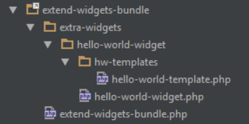

# Creating a Widget

A Widgets Bundle widget is a folder with a PHP file that declares the widget, a template that outputs it and an optional LESS stylesheet. The Widgets Bundle builds the widget's form from the fields you declare, then saves and renders the widget for you.

## Registering a Widgets Folder

The `siteorigin_widgets_widget_folders` filter registers a folder of your own widgets, so you can keep them apart from the SiteOrigin widgets:

```php
<?php

function add_my_awesome_widgets_collection( $folders ) {
	$folders[] = plugin_dir_path( __FILE__ ) . 'widgets/'; // An absolute path. The slash at the end is required.
	return $folders;
}
add_filter( 'siteorigin_widgets_widget_folders', 'add_my_awesome_widgets_collection' );
```

The Widgets Bundle looks for PHP files in each subfolder of a registered folder. It lists every file whose metadata header has a `Widget Name` field as a widget that users can activate and use in widget areas, Page Builder and the Block Editor.

The `extend-widgets-bundle` plugin in our [so-dev-examples](https://github.com/siteorigin/so-dev-examples) repository is a standard WordPress plugin that uses this filter to add its `extra-widgets` folder.

## Naming the Widget Folder

Create a folder for your widget, and a PHP file inside it with the same name. Follow the WordPress [naming best practices](https://developer.wordpress.org/plugins/plugin-basics/best-practices/) for the file and folder names.

## Adding the Metadata Header

Start the PHP file with a metadata header. The Widgets Bundle uses the header to find files that contain a widget, and it skips any file without a `Widget Name` field. The other fields are optional, and they give users more information about the widget and its author:

```php
<?php

/*
Widget Name: Hello world widget
Description: An example widget which displays 'Hello world!'.
Author: Me
Author URI: http://example.com
Documentation: http://example.com/hello-world-widget-docs
*/
```

## Writing the Widget Class

Your widget class extends the `SiteOrigin_Widget` base class. `SiteOrigin_Widget` builds on the WordPress Widgets API, so the class needs a constructor that describes the widget. Declare the form fields in a `get_widget_form()` method, as the example does. Passing `$form_options` to the constructor also works.

Register the class with `siteorigin_widget_register()`, passing the widget ID, the path of the widget file and the class name:

```php
class Hello_World_Widget extends SiteOrigin_Widget {

	function __construct() {
		// Here you can do any preparation required before calling the parent constructor, such as including additional files or initializing variables.

		// Call the parent constructor with the required arguments.
		parent::__construct(
			// The unique id for your widget.
			'hello-world-widget',
			// The name of the widget for display purposes.
			__( 'Hello World Widget', 'hello-world-widget-text-domain' ),
			// The $widget_options array, which is passed through to WP_Widget.
			// It has a couple of extras like the optional help URL, which should link to your sites help or support page.
			array(
				'description' => __( 'A hello world widget.', 'hello-world-widget-text-domain' ),
				'help'        => 'http://example.com/hello-world-widget-docs',
			),
			// The $control_options array, which is passed through to WP_Widget
			array(),
			// We set $form_options using the get_widget_form method below.
			false,
			// The $base_folder path string.
			plugin_dir_path( __FILE__ )
		);
	}

	public function get_widget_form() {
		return array(
			'text' => array(
				'type'    => 'text',
				'label'   => __( 'Hello world! goes here.', 'hello-world-widget-text-domain' ),
				'default' => 'Hello world!',
			),
		);
	}
}
siteorigin_widget_register( 'hello-world-widget', __FILE__, 'Hello_World_Widget' );
```

The widget now appears in the list at **Plugins > SiteOrigin Widgets**. New widgets start inactive, so activate the Hello World Widget there before you use it. Its form has a text field with the default text "Hello world!", which users can edit and save. The widget shows nothing on the front end until it has a template.

## Adding a Template

The template outputs the widget. The Widgets Bundle looks for `tpl/default.php` in your widget folder. Override `get_template_name()` to use another template, and return the template's file name without `.php`. Override `get_template_dir()` to use another folder, and return the folder's path relative to the widget class file, without leading or trailing slashes:

```php
function get_template_name( $instance ) {
	return 'hello-world-template';
}

function get_template_dir( $instance ) {
	return 'hw-templates';
}
```

The Hello World Widget's files are laid out like this:



The Hello World Widget's template outputs the widget's text:

```php
<div>
	<?php echo wp_kses_post( $instance['text'] ); ?>
</div>
```

The widget now shows its text on the front end.

## Adding Styles

The Widgets Bundle loads `styles/default.less` from your widget folder. Override `get_style_name()` to use another LESS stylesheet in the `styles` folder, and return the stylesheet's file name without `.less`. [LESS Stylesheets](../templating/less-stylesheets.md) explains how the Widgets Bundle uses LESS.

```php
function get_style_name( $instance ) {
	return 'my-widget-styles';
}
```

## Adding a Banner Image

Each widget has a banner in the list at **Plugins > SiteOrigin Widgets**. Save your banner as `assets/banner.svg` in your widget folder, or set its URL with the `siteorigin_widgets_widget_banner` filter. This example sits in `my-awesome-widget.php`, outside the class. If you put the code in another file, change the image path to match:

```php
function my_awesome_widget_banner_img_src( $banner_url, $widget_meta ) {
	if ( $widget_meta['ID'] == 'my-awesome-widget' ) {
		$banner_url = plugin_dir_url( __FILE__ ) . 'images/awesome_widget_banner.svg';
	}
	return $banner_url;
}
add_filter( 'siteorigin_widgets_widget_banner', 'my_awesome_widget_banner_img_src', 10, 2 );
```
