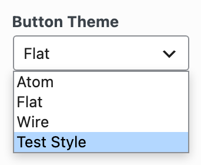

# Extending Existing Widgets

Your theme or plugin can add its own style to one of the Widgets Bundle's widgets, so users get a version that matches your design without a new widget. This example adds a button theme to the Button Widget, with its own template and LESS stylesheet.

## Adding the Option to the Form

The Button Widget's form comes from `get_widget_form()` in `widgets/button/button.php` in the Widgets Bundle. Its `design` section, **Design and Layout**, has a `theme` field, **Button Theme**, where users choose a button theme. This filter adds a **Test Style** option to that field:

```php
function mytheme_extend_button_form( $form_options, $widget ) {
	// Lets add a new theme option.
	if ( ! empty($form_options['design']['fields']['theme']['options']) ) {
		$form_options['design']['fields']['theme']['options']['test'] = __( 'Test Style', 'your-text-domain' );
	}

	return $form_options;
}
add_filter( 'siteorigin_widgets_form_options_sow-button', 'mytheme_extend_button_form', 10, 2 );
```

Each widget runs its own form filter, `siteorigin_widgets_form_options_{$id_base}`, where `$id_base` is the first argument of the widget's constructor: `sow-button` for the Button Widget. The function checks that the `theme` field exists before it adds the option.



## Changing the Template File

When a user chooses your button theme, the Button Widget needs your template file. A Widgets Bundle template is a PHP file that receives the widget's values in an `$instance` array, along with the values from `get_template_variables()`. This filter loads your template when the `theme` value is `test`:

```php
function mytheme_button_template_file( $filename, $instance, $widget ) {
	// Check if the user has selected your custom theme.
	if ( ! empty($instance['design']['theme']) && $instance['design']['theme'] == 'test' ) {
		// This option works for plugins.
		$filename = plugin_dir_path( __FILE__ ) . 'tpl/button.php';

		// For a theme, use this line instead.
		// $filename = get_stylesheet_directory() . '/tpl/button.php';
	}

	return $filename;
}
add_filter( 'siteorigin_widgets_template_file_sow-button', 'mytheme_button_template_file', 10, 3 );
```

Change `test` to your theme's option key and `button.php` to your template's file name. The Button Widget's own template, `widgets/button/tpl/default.php`, shows what a button template uses, so copy it to your theme or plugin as a starting point. [HTML Templates](../templating/html-templates.md) explains how templates work.

The template filter is optional. Without it, the Button Widget uses its own `default.php` template for your button theme.

## Changing the LESS File

The Button Widget looks for a LESS file named after the selected button theme, so your button has no styles until this filter points to your LESS file:

```php
function mytheme_button_less_file( $filename, $instance, $widget ) {
	// Check if the user has selected your custom theme.
	if ( !empty($instance['design']['theme']) && $instance['design']['theme'] == 'test' ) {
		// This option works for plugins.
		$filename = plugin_dir_path( __FILE__ ) . 'less/test.less';

		// For a theme, use this line instead.
		// $filename = get_stylesheet_directory() . '/less/test.less';
	}

	return $filename;
}
add_filter( 'siteorigin_widgets_less_file_sow-button', 'mytheme_button_less_file', 10, 3 );
```

[LESS Stylesheets](../templating/less-stylesheets.md) explains how the Widgets Bundle uses LESS.
