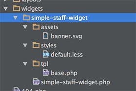

# Adding a Custom Widget to Your Theme

In this tutorial, we'll go over how you'd go about adding a new widget to your theme. This functionality is ideal if you want to give your theme users a little something extra when the install the Widgets Bundle. It doesn't take very long to implement, and it can give your users some real value.

If all you want to do is extend our existing widgets, then you can read the guide on [extending widgets](../getting-started/extending-existing-widgets.md). This guide deals with adding entirely new widgets to your theme.

## Creating a Widgets Folder

To start, you'll need to create a folder in your theme dedicated to any widgets you'll be adding, and then registering that folder as a SiteOrigin widgets folder.

In this example, we'll just create a folder called widgets.

Now you need to register that folder as a Widgets Bundle folder. You can add this to your theme's `functions.php`.

```php
function wbexample_add_widget_folders( $folders ){
    $folders[] = get_template_directory() . '/widgets/';
    return $folders;
}
add_filter('siteorigin_widgets_widget_folders', 'wbexample_add_widget_folders');
```

This function tells the Widgets Bundle to look in a folder called widgets in the main template directory.

## Adding a Widget to the Widgets Folder

In this guide, we'll create a simple staff widget. So create a folder called simple-staff-widget, and in that, a file called simple-staff-widget.php. You can also create the tpl, styles and assets.



There are a few steps to creating a widget, but we're not going to cover every single step here. You should read the [creating a widget](../getting-started/creating-a-widget.md) guide as well as the sections on [HTML templates](../templating/html-templates.md) and [LESS Stylesheets](../templating/less-stylesheets.md) to get a clearer idea of how to create a new widget.

## Activating Your Widget

Newly created widgets aren't active by default in the Widgets Bundle. Your users either need to manually activate your widgets, or you can use `activate_widget` in the `SiteOrigin_Widgets_Bundle`.

After a user installs your theme, you could add the following function.

```php
function wbexample_activate_bundled_widgets(){
    // Stop if the Widgets Bundle isn't active.
    if ( ! class_exists( 'SiteOrigin_Widgets_Bundle' ) ) {
        return;
    }

    if( !get_theme_mod('bundled_widgets_activated') ) {
        if ( SiteOrigin_Widgets_Bundle::single()->activate_widget( 'simple-staff-widget' ) ) {
            set_theme_mod( 'bundled_widgets_activated', true );
        }
    }
}
add_action('admin_init', 'wbexample_activate_bundled_widgets');
```

This function activates the widget in the `simple-staff-widget` folder on `admin_init`. The ID passed to `activate_widget()` is the widget's folder name. We're using a theme mod to make sure this only runs until the widget is activated.